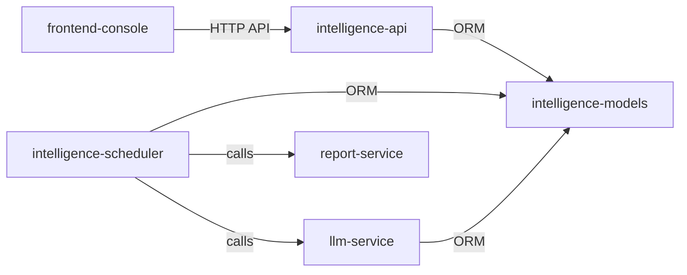

# Components Index（地图层：只导航）

| module | priority | owner | code_entry | api_contract | data_contract | ops_entry | status |
|--------|----------|-------|------------|--------------|---------------|-----------|--------|
| frontend-console | P0 | FS | [frontend/src/](../../../frontend/src/) | - | - | [ops](../ops/index.md) | - [ ] |
| intelligence-api | P0 | FS | [backend/apps/intelligence/views.py](../../../backend/apps/intelligence/views.py) | [api](./intelligence-api.md#api-contract) | - | [ops](../ops/index.md) | - [x] |
| intelligence-models | P0 | FS | [backend/apps/intelligence/models.py](../../../backend/apps/intelligence/models.py) | - | [data](./intelligence-models.md#data-contract) | [ops](../ops/index.md) | - [x] |
| intelligence-scheduler | P0 | FS | [backend/apps/intelligence/scheduler.py](../../../backend/apps/intelligence/scheduler.py) | - | [service](./intelligence-scheduler.md#service-contract) | [ops](../ops/index.md) | - [x] |
| llm-service | P0 | FS | [backend/apps/intelligence/services/llm_service.py](../../../backend/apps/intelligence/services/llm_service.py) | - | [service](./llm-service.md#service-contract) | [ops](../ops/index.md) | - [x] |
| report-service | P1 | FS | [backend/apps/intelligence/services/report_service.py](../../../backend/apps/intelligence/services/report_service.py) | - | [service](./report-service.md#service-contract) | [ops](../ops/index.md) | - [x] |

## Dependencies（direct only）

