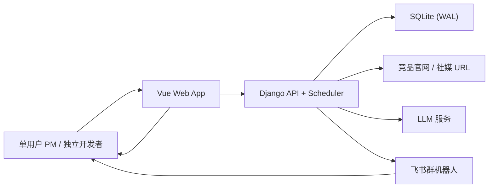
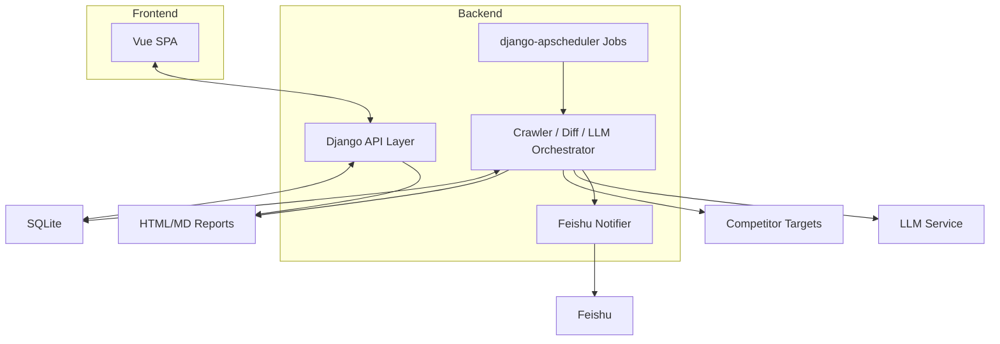

目的：产出可评审的决策文档（RFC / Decision Doc），作为 implementation 的权威输入。本文只写架构决策、边界、契约承诺要点与验证策略；不写任务拆分、DDL 细节或实现步骤。

落盘位置：`/Users/melody/code/ai-workshop/.aisdlc/specs/001-competitive-intel-agent/design/design.md`

## 0. 基本信息

- 需求标识（分支 / ID）：001-competitive-intel-agent
- 标题（需求名 / RFC 名）：Vue 前端 + Django API/调度后端的竞争情报单体架构 RFC
- 作者：Codex（基于 Spec 001 需求文档整理）
- 评审人：PM；FS；Leader
- 状态：draft
- 最后更新：2026-07-07
- 关联链接（讨论、资料、工单）：
  - `/Users/melody/code/ai-workshop/.aisdlc/specs/001-competitive-intel-agent/requirements/solution.md`
  - `/Users/melody/code/ai-workshop/.aisdlc/specs/001-competitive-intel-agent/requirements/prd.md`
  - `/Users/melody/code/ai-workshop/.aisdlc/specs/001-competitive-intel-agent/requirements/prototype.md`

## 1. 结论摘要（3-7 行）

- 一句话目标：将 Spec 001 落为一个前后端分离但仍保持单体交付的竞争情报系统，前端统一使用 Vue 提供任务配置、调度执行列表、收件箱、详情与报告预览；后端使用 Django 承担 API、调度、采集、LLM 编排、报告产物生成与飞书推送。
- In / Out 边界：In = Vue 产品前端、Django JSON API、日级采集、独立降噪 LLM、diff 熔断、单次情报生成 LLM、报告产物、飞书卡片、Negative Few-Shot 反馈闭环；Out = 多服务拆分、多租户、消息队列、实时监控、第三方流量 API、Slack/邮件。
- 推荐方案：采用“同仓库 Vue SPA + Django 单体后端 + SQLite + django-apscheduler”的 split-monolith 方案，所有产品页面通过前端消费 API，不再依赖 Django Admin/Jinja2 作为产品入口。
- 关键取舍：保留单体后端以压低 MVP 复杂度，同时用前后端分离保证产品页面一致性；用“收件箱只看 CHANGED、执行列表看全量状态”降低消费噪音并保留运维追溯能力。
- 优先验证点：R1（同域 Session/CSRF 与 API 契约稳定性）、R2（降噪 + 情报生成 prompt 质量）、R3（执行列表与收件箱的信息架构是否足够清晰）。

## 2. 范围与边界

- 系统边界：
  - 系统内部：Vue Web 前端、Django API/调度应用、SQLite、采集/降噪/情报生成/报告产物/飞书通知模块。
  - 系统外部：竞品网站 / 社媒 URL、LLM 服务、飞书群机器人。
- 影响面（上下游 / 数据口径 / 运维）：
  - 上游是用户输入的竞品 URL、自有产品锚定文档与 cron 配置。
  - 下游是飞书卡片、HTML/MD 报告产物以及用户在前端的浏览与反馈。
  - 运维层面仅需要日级调度、失败重试、基础日志和执行记录可追溯，不引入队列与分布式任务系统。
- 明确不做什么（Out）：
  - 不做多租户、团队协作、角色权限体系。
  - 不做小时级 / 实时采集。
  - 不做多模型多阶段编排、消息队列或微服务拆分。
  - 不把 Django Admin 作为产品主入口。
- 不变量（不会改变的语义 / 口径 / 安全边界）：
  - 快照 append-only。
  - 降噪 LLM 与情报生成 LLM 必须独立。
  - diff 为空即熔断，不触发情报生成。
  - 情报固定 4 字段，无价值度字段。
  - 收件箱仅展示 `CHANGED`；执行列表展示 `CHANGED` / `NO_CHANGE` / `ERROR_CRAWL`。
  - httpx 优先，Playwright 仅 SPA 兜底。
  - 调度使用 django-apscheduler 日级执行。

## 3. 推荐方案（按 C4 L1-L3）

### 3.1 C4-L1：System Context（系统上下文）

- 用户/角色：
  - 单用户产品经理 / 独立开发者：配置监控任务、查看执行结果、消费情报、提交反馈。
- 外部系统：
  - 竞品官网 / 社媒 URL：被采集的目标站点。
  - LLM 服务：完成降噪与情报生成。
  - 飞书群机器人：接收变更通知卡片。
- 系统边界：
  - Vue 前端负责所有产品交互页面。
  - Django 应用负责 API、定时调度、采集与分析编排、报告产物和通知。
- 关键交互与主要输入输出：
  - 用户通过前端写入监控配置。
  - 后端定时拉取页面内容并生成执行结果与情报。
  - 前端读取执行记录 / 收件箱 / 详情 / 报告预览。
  - 飞书卡片把用户引回前端报告页面。
- 关键约束与不变量：
  - 单用户、单体部署、SQLite、日级任务、双 LLM 调用分离。

### 3.2 C4-L2：Container（容器 / 部署单元）

- 容器清单（服务 / 作业 / 数据库）：
  - **Vue Web App**：单页前端，提供任务配置、执行列表、收件箱、详情、报告预览。
  - **Django Application**：统一承载 API、调度器、采集与分析编排、反馈写入、报告元数据查询。
  - **SQLite**：存储 `MonitorProject`、`DataSnapshot`、`IntelligenceFeed`。
  - **Report Storage（本地文件系统）**：存 HTML/MD 报告产物。
- 每个容器职责与主要技术选型：
  - Vue：用户交互、路由、状态管理、API Client、同域 Session/CSRF 写操作。
  - Django：业务编排、持久化、调度、采集器、LLM 调用、飞书适配器。
  - SQLite：轻量持久化与 append-only 快照约束。
  - 文件系统：报告落盘与下载源。
- 关键数据流：
  - 前端写配置 -> Django API -> MonitorProject。
  - 调度器读取 MonitorProject -> 采集 / 降噪 / diff / 生成情报 -> DataSnapshot / IntelligenceFeed / 文件系统。
  - 前端读执行记录 / 情报详情 / 报告元数据 -> Django API。
  - Django 推飞书卡片 -> 用户跳转 Vue 报告页。
- 对外契约入口（contracts / API）：
  - 前端契约：项目配置 API、执行列表 API、收件箱 API、详情 API、反馈 API、报告预览 / 下载 API。
  - 外部契约：飞书卡片 payload、LLM 结构化输出 schema。

### 3.3 C4-L3：Component（组件）

- 关键组件拆分（职责 / 接口 / 依赖）：
  - **ProjectConfig API**：处理任务配置的读写、字段校验、调度注册更新。
  - **RunQuery API**：输出执行列表、筛选条件、错误摘要与状态详情。
  - **Inbox API**：只返回 `CHANGED` 情报列表与详情。
  - **Feedback API**：写入 `user_feedback` / `user_comment`，供后续 few-shot 注入。
  - **Scheduler Runner**：按 cron 拉起单个项目的日级执行。
  - **Crawler Adapter**：httpx 采集，按需 fallback Playwright。
  - **Noise Reduction Service**：html2text + LLM 降噪，输出 `raw_markdown` / `clean_markdown`。
  - **Snapshot Repository**：append-only 快照写入与读取上一条快照。
  - **Diff Gate**：生成 diff 并判断是否熔断。
  - **Intel Generator**：单次 LLM 输出 4 字段情报，注入产品锚定与最近 5 条负反馈。
  - **Report Service**：生成 HTML/MD 报告产物，提供预览元数据。
  - **Feishu Service**：构造卡片 payload 并发送。
- 关键数据模型与状态流转（组件层）：
  - `MonitorProject`：配置源头，驱动调度与采集。
  - `DataSnapshot`：每次降噪后新增一条，不可修改。
  - `IntelligenceFeed`：作为执行结果与情报统一日志；状态在 `CHANGED` / `NO_CHANGE` / `ERROR_CRAWL` 间三选一。
  - 执行链状态：`FETCH` -> `DENOISE` -> `SNAPSHOT` -> `DIFF` -> (`NO_CHANGE` | `CHANGED` | `ERROR_CRAWL`)。
- 错误处理与幂等 / 一致性策略：
  - 单次执行失败只影响该次记录，不阻塞其他任务。
  - `NO_CHANGE` 仍保留执行记录，保证前端可追溯。
  - 反馈写入不影响既有报告内容，只影响后续推理上下文。
  - 报告产物生成与飞书推送解耦；飞书失败时情报仍视为已生成。

### 3.4 关键决策与取舍（≥3 条）

| # | 决策点 | 选择 | 取舍理由（为什么选它） | 若不满足前提的降级/替代 |
|---|---|---|---|---|
| D1 | 产品前端形态 | Vue SPA 承担全部产品页面 | 满足用户“前端全部采用 Vue”的明确裁决，统一配置、执行、消费体验 | 若前端开发压力过高，可先用 Vue 覆盖核心页面，Django Admin 仅作内部临时工具，但不作为产品主入口 |
| D2 | 后端运行形态 | Django 单体同时承载 API、调度、采集与通知 | 与 MVP 规模匹配，避免引入多服务与队列的额外复杂度 | 若任务量和并发显著增长，再拆调度/采集为独立作业进程 |
| D3 | 执行结果信息架构 | 收件箱只展示 `CHANGED`；执行列表展示全量状态 | 降低情报消费噪音，同时保留排障与执行追溯能力 | 若用户仍难以理解，可在收件箱增加“查看全部执行记录”的跳转而不混合列表 |
| D4 | 报告展示机制 | 报告产物落盘 + 前端预览页消费 API/元数据 | 保留可分享 / 可下载产物，同时不把产品 UI 绑回服务端模板 | 若 HTML 产物体验不稳定，前端可直接用结构化字段渲染基础预览 |
| D5 | 写操作安全机制 | 同域部署 + Django Session/CSRF | 对单体项目最简单，避免引入早期 token 体系和额外认证复杂度 | 若部署形态不能同域，再切换 token 方案 |

### 3.5 对外承诺要点

只写要点与追溯入口，不在本文件写字段清单或迁移脚本。

- 契约（前端 API）：
  - 项目配置 API 需要支持创建 / 更新监控任务、校验 `competitor_urls`、返回调度注册结果。
  - 执行列表 API 需要支持项目 / 状态 / 时间范围筛选，并返回错误摘要。
  - 收件箱 API 必须只返回 `CHANGED`。
  - 情报详情 API 必须返回 4 字段、反馈状态、报告入口元数据。
  - 反馈 API 必须支持写入负反馈和评语。
- 契约（外部集成）：
  - LLM 输出契约固定为 4 字段结构化结果。
  - 飞书卡片需包含变化摘要、在线预览、下载 MD 入口。
- 权限：
  - MVP 仅单用户，不引入复杂权限模型；默认同域登录态。
- 数据口径：
  - `NO_CHANGE` 是执行结果，不是“无记录”。
  - `ERROR_CRAWL` 是执行失败状态，不应进入收件箱。
- 兼容性：
  - 当前仓库为绿地项目，无历史前端 / API 兼容包袱。
  - 未来若 API 形态调整，应优先保持 Vue BFF / DTO 向后兼容。
- 迁移与回滚：
  - 当前无存量系统迁移；回滚策略以“停用前端新入口 + 保留后端数据与报告产物”为主。

## 4. 与现有系统的对齐（基于 `requirements/solution.md#impact-analysis`）

### 4.1 契约兼容性声明（逐模块）

本仓库当前缺失 `project/components/index.md` 与具体组件页，以下条目只能做基于需求侧 SSOT 的设计声明，**不能视为“已完成现有系统对齐”**。

- 模块：Vue 前端壳层 / 路由
  - API Contract：`CONTEXT GAP`，`/Users/melody/code/ai-workshop/.aisdlc/project/components/` 不存在，无法引用现有组件契约。
  - Data Contract：`CONTEXT GAP`
  - 兼容性结论：绿地新增能力；由于缺少组件页，无法正式声明“已与现有契约兼容”。
- 模块：Django API 层
  - API Contract：`CONTEXT GAP`
  - Data Contract：`CONTEXT GAP`
  - 兼容性结论：绿地新增能力；后续必须在项目契约文档落地 API / DTO。
- 模块：调度器 / 采集 / 降噪 / diff / 报告 / 通知
  - API Contract：`CONTEXT GAP`
  - Data Contract：`CONTEXT GAP`
  - 兼容性结论：绿地新增能力；当前仅能对齐 `solution.md` 中的不变量，不能宣称已与现有模块页对齐。

### 4.2 ADR 合规声明（逐 ADR）

- `project/adr/index.md`：`CONTEXT GAP`，目录不存在。
- ADR 合规结论：
  - 当前无法声明“遵守现有 ADR”或“需修改现有 ADR”，因为仓库没有可读 ADR 索引与正文。
  - 若本设计获批，建议在实现前补最少一篇 ADR，记录“为何采用 Vue + Django split-monolith、为何不拆多服务、为何使用同域 Session/CSRF”。

### 4.3 状态机 / 领域事件影响

- `project/components/{module}.md#State Machines & Domain Events`：`CONTEXT GAP`
- 当前设计侧声明：
  - 新增执行结果状态：`CHANGED` / `NO_CHANGE` / `ERROR_CRAWL`
  - 不引入异步事件总线；状态流转由 Django 单体内同步编排完成。
  - 由于缺少现有组件页，无法声明对既有状态机 / 领域事件“已完成兼容性核对”。

### 4.4 跨模块影响确认

- `project/components/index.md`：`CONTEXT GAP`
- 基于需求文档的跨模块确认：
  - 前端配置页依赖项目配置 API。
  - 执行列表依赖执行记录查询 API。
  - 收件箱 / 详情 / 报告预览依赖情报详情与报告元数据 API。
  - 调度器依赖 `MonitorProject` 配置、快照存储、diff 熔断、情报生成、通知服务。
- DoD 判定说明：
  - 由于 `.aisdlc/project/` 完全缺失，**“与现有系统的对齐已完成”不能判定为通过**。
  - 这不是因为方案不成立，而是因为项目知识库不存在，无法完成 skill 要求的全文对齐核验。

## 5. 影响分析

- 上下游系统影响：
  - 上游输入由原来的后端配置入口彻底切到 Vue 前端表单。
  - 下游飞书卡片仍保留，但在线预览目标从旧的 HTML 页面切到 Vue 报告路由。
- 数据口径影响：
  - `IntelligenceFeed` 同时承担执行记录与情报记录语义。
  - “执行列表看全量、收件箱只看变化”成为稳定口径。
- 运行与运维影响（监控 / 容量 / 告警 / 权限 / 审计）：
  - 需要最少的执行日志、失败原因、飞书推送结果与手动重跑能力。
  - 由于 SQLite + 单体部署，容量与并发边界必须保持日级、轻量任务规模。
  - 同域 Session/CSRF 方案要求前后端部署拓扑保持简单。
- 迁移 / 回滚要点（机制级）：
  - 当前是绿地项目，无旧前端和旧 API 的迁移成本。
  - 回滚优先级：停用新的 Vue 前端入口 > 保留已有快照与执行记录 > 保留报告产物审计能力。

## 6. 风险与验证清单（可执行；所有不确定性仅写在此处）

| # | 风险/假设 | 验证方式 | 成功信号 | 失败信号 | Owner | 截止 | 下一步动作 |
|---|---|---|---|---|---|---|---|
| R1 | Vue 与 Django 的同域 Session/CSRF 集成可能在实际部署中出现写操作失败 | 在 MVP 环境联调配置保存、反馈提交、文件上传 | 配置/反馈成功率稳定，无 CSRF / Cookie 异常 | 写操作频繁失败或需要复杂绕行 | FS | I1 | 若失败，补 token 方案 ADR / research |
| R2 | 执行列表与收件箱的双视图模型可能让用户理解成本变高 | 原型走查 + 首批真实使用反馈 | 用户能区分“监控执行”与“情报消费” | 用户反复在错误页面寻找记录 | PM | R3/I2 | 调整导航信息架构或增加跨页跳转 |
| R3 | 报告产物落盘 + 前端预览的双轨方案可能导致展示不一致 | 对同一条情报比对详情页与报告预览页 | 两者核心字段一致，下载/预览体验稳定 | 前端预览和离线产物内容偏差明显 | FS | I2 | 降级为前端直接用结构化字段渲染 |
| R4 | 采集 / 降噪 / diff / 生成都在单体内编排，错误边界不清时会影响排障效率 | 为每个阶段定义执行日志字段并检查原型可见性 | 可以定位失败发生在采集、降噪、熔断还是通知阶段 | 失败记录只有最终状态，无法定位阶段 | FS | I1/I2 | 增加阶段化日志模型或结构化错误码 |
| R5 | 项目知识库缺失导致“与现有系统对齐”无法正式完成 | 补齐 `.aisdlc/project/` 最小骨架或 ADR/组件页 | 能引用 components/adr 正文完成对齐声明 | 继续无 project 目录，RFC 只能以阻塞项状态存在 | Leader + PM | 进入实现前 | 决定是否先补 discover / ADR 最小集 |

## 7. 追溯链接

- `/Users/melody/code/ai-workshop/.aisdlc/specs/001-competitive-intel-agent/requirements/solution.md`
  - 必读：`#impact-analysis`
  - 关键引用：推荐方案、验证清单、受影响模块、不变量、跨模块影响
- `/Users/melody/code/ai-workshop/.aisdlc/specs/001-competitive-intel-agent/requirements/prd.md`
  - 关键引用：功能清单、场景、AC、风险/依赖、原型判定
- `/Users/melody/code/ai-workshop/.aisdlc/specs/001-competitive-intel-agent/requirements/prototype.md`
  - 关键引用：Vue 页面清单、任务流、交互节点、AC 映射
- `/Users/melody/code/ai-workshop/.aisdlc/project/components/index.md`
  - `CONTEXT GAP`：文件不存在
- `/Users/melody/code/ai-workshop/.aisdlc/project/components/{module}.md`
  - `CONTEXT GAP`：目录不存在
- `/Users/melody/code/ai-workshop/.aisdlc/project/adr/index.md`
  - `CONTEXT GAP`：文件不存在
- `/Users/melody/code/ai-workshop/.aisdlc/specs/001-competitive-intel-agent/design/research.md`
  - 当前不存在，未使用

## 8. 迭代记录（追加，不覆盖）

- 2026-07-07：基于更新后的 `solution.md` / `prd.md` / `prototype.md` 首次产出 D2 RFC，明确 Vue + Django split-monolith 的系统边界、容器拆分、关键决策与风险清单。
- 2026-07-07：确认 `.aisdlc/project/` 缺失，按 `CONTEXT GAP` 写入契约兼容性、ADR 合规与跨模块对齐阻塞，避免把缺口误判为已对齐。
