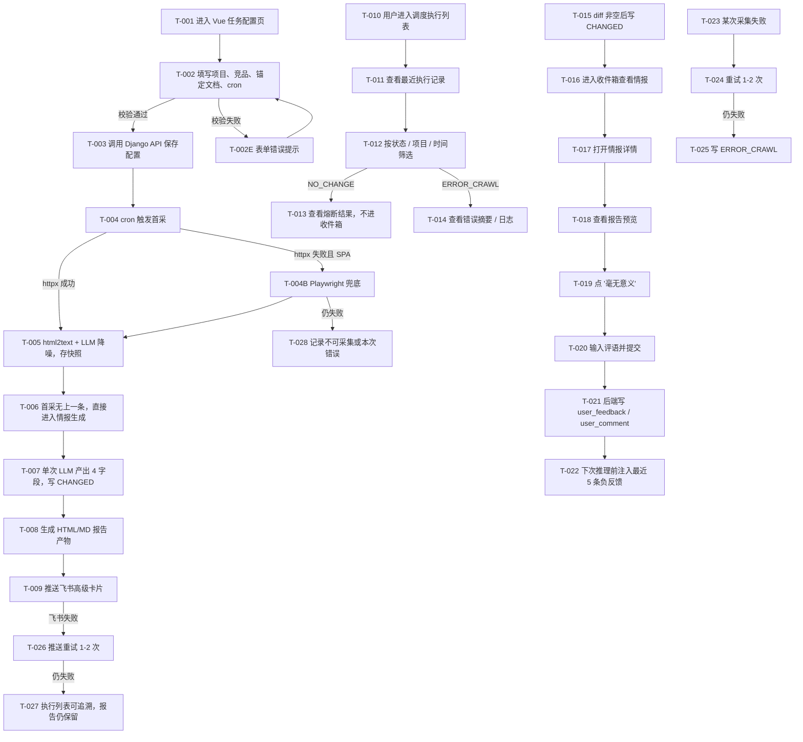

> 目的：把 `requirements/prd.md` 的核心场景 / 规则 / AC 转成可走查、可评审、可验证的交互说明。
>
> 规则：只写会影响实现和验收的最小信息；不写“待确认问题”清单；所有不确定性统一引用 PRD / solution 的验证清单。

## 0. 基本信息

- 需求标识（分支 / ID）：001-competitive-intel-agent
- 作者 / 参与评审：FS（作者）；PM（评审）；Leader（评审）
- 状态：draft
- 最后更新：2026-07-07
- Figma 链接入口：无（MVP 用 ASCII 线框）

## 1. 场景清单（与 PRD 对齐）

| 场景编号 | 场景标题（用户视角） | 成功标准（1-3 条） | 任务流节点（T-xxx…） | 页面链路摘要（P-xxx → …） | PRD 对应 AC |
|---|---|---|---|---|---|
| S-001 | 通过 Vue 页面配置任务并触发首采 | ① 配置成功；② 首采生成情报；③ 飞书可跳转预览 | T-001~T-009 | P-001 → P-002 → P-005 → D-001 | AC-001~AC-005 |
| S-002 | 在执行列表查看全量状态 | ① 可看 NO_CHANGE / ERROR_CRAWL；② 可筛选；③ 收件箱不混入 | T-010~T-014 | P-002 | AC-006~AC-009 |
| S-003 | 在收件箱消费情报并提交反馈 | ① CHANGED 进入收件箱；② 可查看详情；③ 反馈进入下次推理 | T-015~T-022 | P-003 → P-004 → P-005 | AC-010~AC-013 |
| S-004 | 处理异常路径与兜底 | ① 采集失败可追溯；② 飞书失败不丢报告；③ SPA 可兜底 | T-023~T-028 | P-002 → P-004 | AC-014~AC-017 |

## 2. 端到端任务流

> 节点编号：T-001…；页面 P-001…；弹窗 D-001…



## 3. 页面 / 弹窗清单

| Node ID | 类型 | 名称 / 目的 | 入口 | 覆盖任务流节点 | 覆盖场景 | 备注 |
|---|---|---|---|---|---|---|
| P-001 | P | Vue - 任务配置页 | 路由 `/projects/new`、`/projects/:id/edit` | T-001,T-002,T-002E,T-003 | S-001 | 创建 / 编辑监控任务 |
| P-002 | P | Vue - 调度执行列表 | 路由 `/runs` | T-010~T-014,T-025,T-027,T-028 | S-002,S-004 | 展示全量执行状态 |
| P-003 | P | Vue - 收件箱列表 | 路由 `/intel` | T-016 | S-003 | 仅展示 `CHANGED` |
| P-004 | P | Vue - 情报详情页 | P-003 点击进入 | T-017,T-019,T-020,T-021 | S-003,S-004 | 含反馈入口 |
| P-005 | P | Vue - 报告预览页 | P-004 或飞书卡片按钮进入 | T-008,T-018,T-009 | S-001,S-003 | 报告内容与下载入口 |
| D-001 | D | 飞书高级卡片 | 飞书群机器人推送 | T-009 | S-001,S-003 | 含在线预览 / 下载 MD |

## 4. 页面说明（逐页）

### 4.1 P-001 Vue - 任务配置页

#### 4.1.1 入口与目的

- **ID**：P-001
- **页面目的**：创建 / 编辑监控任务，录入竞品 URL、产品锚定文档、飞书 webhook、cron 等核心配置
- **入口**：路由 `/projects/new` 或 `/projects/:id/edit`
- **前置条件**：用户已进入系统；单用户场景
- **涉及场景**：S-001

#### 4.1.2 ASCII 线框

```text
P-001 Vue - 任务配置页
+--------------------------------------------------------------------+
| 监控任务配置                                           [返回列表]   |
+--------------------------------------------------------------------+
| 项目名称                                                           |
| [____________________________________________]                    |
|                                                                    |
| 自有产品锚定文档                                                   |
| [ 文本输入区域................................................. ]  |
| [上传 .md/.html 文件] 当前文件: anchor.md                         |
|                                                                    |
| 竞品列表                                                           |
| +--------------------------------------------------------------+   |
| | 标题           | URL                              | 操作      |   |
| | [A官网______]  | [https://a.com______________]   | [删除]    |   |
| | [B官网______]  | [https://b.com______________]   | [删除]    |   |
| +--------------------------------------------------------------+   |
| [新增一行]                                                         |
| <错误提示：title/url 缺失或 URL 非法>                              |
|                                                                    |
| 飞书 Webhook                                                       |
| [https://open.feishu.cn/open-apis/bot/v2/hook/______________]     |
|                                                                    |
| 调度时间                                                           |
| [每天] [09:00 v]  或  [cron 高级模式开关]                          |
| <错误提示：cron 非法>                                              |
|                                                                    |
| 启用状态 [x]                                                       |
|                                                                    |
| 操作: [保存] [保存并立即执行一次] [取消]                           |
+--------------------------------------------------------------------+
```

#### 4.1.3 关键状态与反馈

| 状态 | 触发条件 | 界面要点 | 恢复路径 |
|---|---|---|---|
| 正常 | 首次进入 / 编辑中 | 可录入字段，竞品列表支持增删行 | - |
| 校验失败 | URL / title / webhook / cron 非法 | 字段下方显示错误文案，保存按钮保留 | 修正后重新提交 |
| 保存成功 | API 返回成功 | Toast 提示“保存成功”，可跳执行列表 | 继续编辑或查看执行 |
| 保存中 | 提交 API | 按钮 loading，防重复提交 | 返回结果后恢复 |

#### 4.1.4 关键校验与错误处理

- `competitor_urls` 最少 1 条，每条必须同时有 `title` 与合法 `url`
- `feishu_webhook` 必须为合法 URL
- 调度默认支持“每天固定时间”，高级模式才暴露 cron
- `self_product_doc` 可为空，但若上传文件失败需显式提示

#### 4.1.5 跳转与交互

- 保存成功后可跳转 `/runs?project_id={id}`
- “保存并立即执行一次”触发创建后即时运行接口
- 取消返回上一页或项目列表

### 4.2 P-002 Vue - 调度执行列表

#### 4.2.1 入口与目的

- **ID**：P-002
- **页面目的**：查看任务的全量执行记录，支持筛选 `CHANGED` / `NO_CHANGE` / `ERROR_CRAWL`
- **入口**：路由 `/runs`
- **前置条件**：至少存在一个任务
- **涉及场景**：S-001、S-002、S-004

#### 4.2.2 ASCII 线框

```text
P-002 Vue - 调度执行列表
+--------------------------------------------------------------------+
| 调度执行列表                                          [刷新]       |
+--------------------------------------------------------------------+
| 项目 [全部 v]   状态 [全部 v]   时间 [最近7天 v]   [筛选] [重置]   |
|                                                                    |
| ID  | 项目        | 执行时间           | 状态         | 操作        |
|-----|-------------|--------------------|--------------|------------|
| 42  | AI IDE监控  | 2026-07-07 09:00   | CHANGED      | [查看详情] |
| 41  | AI IDE监控  | 2026-07-06 09:00   | NO_CHANGE    | [查看结果] |
| 40  | AI IDE监控  | 2026-07-05 09:00   | ERROR_CRAWL  | [看错误]   |
|                                                                    |
| 侧边抽屉 / 下方详情：                                               |
| - 状态摘要                                                         |
| - 错误信息 log_message（如有）                                     |
| - HTML / MD 报告入口（仅 CHANGED）                                 |
+--------------------------------------------------------------------+
```

#### 4.2.3 关键状态与反馈

| 状态 | 触发条件 | 界面要点 | 恢复路径 |
|---|---|---|---|
| 正常 | 有执行记录 | 列表分页展示 | - |
| 空 | 无任何执行记录 | 空状态提示“暂无执行记录” | 回配置页创建任务 |
| 错误记录查看 | 点击 `ERROR_CRAWL` | 展示失败原因与重试信息 | 关闭详情面板 |

#### 4.2.4 关键校验与错误处理

- 筛选项变化时需重置分页
- `NO_CHANGE` 不展示报告入口
- `ERROR_CRAWL` 记录必须展示错误摘要，避免只显示状态码

#### 4.2.5 跳转与交互

- `CHANGED` 记录可跳情报详情或报告预览
- `NO_CHANGE` 记录只展示执行摘要
- `ERROR_CRAWL` 记录展示错误详情，不进入收件箱

### 4.3 P-003 Vue - 收件箱列表

#### 4.3.1 入口与目的

- **ID**：P-003
- **页面目的**：消费有变化的情报，列表只展示 `CHANGED`
- **入口**：路由 `/intel`
- **前置条件**：已有 `CHANGED` 记录
- **涉及场景**：S-003

#### 4.3.2 ASCII 线框

```text
P-003 Vue - 收件箱列表
+--------------------------------------------------------------------+
| 竞争情报收件箱                                        [刷新]       |
+--------------------------------------------------------------------+
| [筛选: 项目 / 日期]                                                 |
|--------------------------------------------------------------------|
| #42  AI IDE监控   2026-07-07 09:00                                  |
| 变化摘要: 对方首页新增“AI Agent Workflow”入口...                    |
| [查看详情]                                                         |
|--------------------------------------------------------------------|
| #39  AI IDE监控   2026-07-04 09:00                      [已反馈]    |
| 变化摘要: 定价页新增 Pro Annual 套餐...                            |
| [查看详情]                                                         |
|--------------------------------------------------------------------|
| 空状态：暂无有变化情报                                             |
+--------------------------------------------------------------------+
```

#### 4.3.3 关键状态与反馈

| 状态 | 触发条件 | 界面要点 | 恢复路径 |
|---|---|---|---|
| 正常 | 有 `CHANGED` 记录 | 卡片 / 列表混排均可，但只展示 `CHANGED` | - |
| 空 | 没有 `CHANGED` | 空状态提示 | 等待下一次执行 |

#### 4.3.4 关键校验与错误处理

- 必须从 API 层过滤 `job_status=CHANGED`
- 已反馈的记录要有可见标记，但仍可再次查看

#### 4.3.5 跳转与交互

- 点击“查看详情”进入 `/intel/{id}`
- 列表不提供 `NO_CHANGE` / `ERROR_CRAWL` 的入口

### 4.4 P-004 Vue - 情报详情页

#### 4.4.1 入口与目的

- **ID**：P-004
- **页面目的**：查看完整情报内容并提交反馈
- **入口**：P-003 点击记录，或从执行列表跳入 `CHANGED` 记录详情
- **前置条件**：存在对应情报记录
- **涉及场景**：S-003、S-004

#### 4.4.2 ASCII 线框

```text
P-004 Vue - 情报详情页
+--------------------------------------------------------------------+
| < 返回收件箱                     AI IDE监控 / 2026-07-07 09:00     |
+--------------------------------------------------------------------+
| 变化摘要                                                           |
| [..............................................................]   |
|                                                                    |
| 战略意图                                                           |
| [..............................................................]   |
|                                                                    |
| 行动建议                                                           |
| [..............................................................]   |
|                                                                    |
| 证据 / 报告                                                        |
| [在线预览报告] [下载 MD]                                           |
|                                                                    |
| 反馈                                                               |
| [毫无意义] [有帮助]                                                |
| 评语                                                               |
| [______________________________________________] [提交反馈]       |
+--------------------------------------------------------------------+
```

#### 4.4.3 关键状态与反馈

| 状态 | 触发条件 | 界面要点 | 恢复路径 |
|---|---|---|---|
| 正常 | 详情加载完成 | 展示 4 字段与报告入口 | - |
| 加载 | 请求详情中 | Skeleton / loading | 请求完成后恢复 |
| 反馈成功 | 提交评语成功 | 提示“反馈已记录” | 仍留在当前页 |
| 反馈失败 | API 错误 | 提示错误，不清空输入 | 重试提交 |

#### 4.4.4 关键校验与错误处理

- 反馈按钮可单独点击，“毫无意义”时评语可选但建议填写
- 若报告文件不存在，需退回到详情内容，不允许整页白屏

#### 4.4.5 跳转与交互

- “在线预览报告”进入 `/reports/{id}`
- “下载 MD”触发文件下载
- 反馈提交后局部刷新反馈状态

### 4.5 P-005 Vue - 报告预览页

#### 4.5.1 入口与目的

- **ID**：P-005
- **页面目的**：在前端展示报告内容，并提供下载入口
- **入口**：P-004 或飞书卡片按钮
- **前置条件**：该情报有报告产物
- **涉及场景**：S-001、S-003

#### 4.5.2 ASCII 线框

```text
P-005 Vue - 报告预览页
+--------------------------------------------------------------------+
| < 返回详情                               报告预览      [下载 MD]    |
+--------------------------------------------------------------------+
| 项目: AI IDE监控          生成时间: 2026-07-07 09:00               |
| 来源: A官网 / 首页                                                    |
|--------------------------------------------------------------------|
| 变化摘要                                                           |
| [..............................................................]   |
|--------------------------------------------------------------------|
| 战略意图                                                           |
| [..............................................................]   |
|--------------------------------------------------------------------|
| 行动建议                                                           |
| [..............................................................]   |
|--------------------------------------------------------------------|
| 证据 diff / 片段                                                   |
| [..............................................................]   |
+--------------------------------------------------------------------+
```

#### 4.5.3 关键状态与反馈

| 状态 | 触发条件 | 界面要点 | 恢复路径 |
|---|---|---|---|
| 正常 | 报告可读取 | 展示报告内容与下载按钮 | - |
| 空 / 缺失 | 报告文件不存在 | 提示“报告产物缺失，请返回详情查看摘要” | 返回详情 |

#### 4.5.4 关键校验与错误处理

- 预览内容与详情页核心字段要一致
- 若 HTML 报告产物不可用，至少能用 API 返回的数据渲染基础预览

#### 4.5.5 跳转与交互

- 飞书卡片按钮直达当前页
- 页面内提供返回详情入口

## 5. AC → 交互节点映射

| AC | 场景 | 任务流节点 | 页面 / 节点 | 验证点 |
|---|---|---|---|---|
| AC-001 配置保存成功 | S-001 | T-001~T-003 | P-001 | 表单校验、保存成功提示 |
| AC-002 首采写快照 | S-001 | T-004~T-005 | P-002（后续可见） | 执行记录出现 |
| AC-003 首采生成 CHANGED | S-001 | T-006~T-007 | P-002 / P-003 | 记录状态为 CHANGED，进入收件箱 |
| AC-004 报告产物生成 | S-001 | T-008 | P-005 | 报告页可打开 |
| AC-005 飞书可跳预览 | S-001 | T-009 | D-001 → P-005 | 卡片按钮可打开页面 |
| AC-006 diff 为空不调 LLM | S-002 | T-010~T-013 | P-002 | 看到 NO_CHANGE，收件箱无该记录 |
| AC-008 ERROR_CRAWL 可追溯 | S-002/S-004 | T-023~T-025 | P-002 | 错误摘要可见 |
| AC-010 CHANGED 进入收件箱 | S-003 | T-015~T-016 | P-003 | 列表展示该条情报 |
| AC-011 查看详情 | S-003 | T-017 | P-004 | 4 字段完整显示 |
| AC-012 反馈写回 | S-003 | T-019~T-021 | P-004 | 反馈提交成功 |
| AC-013 负反馈进入下次推理 | S-003 | T-022 | P-004 / P-002 | 后端日志或详情可追溯 |
| AC-015 飞书失败不丢报告 | S-004 | T-026~T-027 | P-002 / P-005 | 执行可追溯，报告仍在 |
| AC-016 Session/CSRF 成功 | S-001/S-003 | T-003,T-020 | P-001 / P-004 | 写操作无 CSRF 报错 |

## 6. 走查 / 验证脚本

### 6.1 任务脚本：首次配置到首采闭环

- 目标：验证 Vue 配置页到飞书卡片的全链路
- 步骤：
  1. 打开 P-001，创建一个任务
  2. 保存并立即执行一次
  3. 在 P-002 查看执行结果
  4. 打开飞书卡片或 P-005 报告预览
- 成功标准：`CHANGED` 记录出现，报告可预览，飞书按钮可跳转
- 观察点：P-001 校验是否清晰；P-002 是否能追溯首采

### 6.2 任务脚本：无变化与错误路径

- 目标：验证执行列表与收件箱职责分离
- 步骤：
  1. 触发一次无变化运行
  2. 触发一次采集失败运行
  3. 打开 P-002 和 P-003 对比查看
- 成功标准：`NO_CHANGE` / `ERROR_CRAWL` 只在 P-002，可筛选；P-003 不展示
- 观察点：错误摘要是否足够排障

### 6.3 任务脚本：反馈闭环

- 目标：验证用户反馈能进入下次推理
- 步骤：
  1. 在 P-003 打开某条情报
  2. 在 P-004 提交“毫无意义”反馈和评语
  3. 再触发一次有变化运行
- 成功标准：反馈写回成功；下次生成使用最近 5 条负反馈
- 观察点：反馈交互是否轻量、是否需要更多反馈文案

## 7. 回流规则

- 若 P-001 的字段与后端模型不对齐，回流 `prd.md` 更新 AC 或字段口径。
- 若 P-002 无法同时承担监控与排障职责，回流 `solution.md` 重新裁切“执行列表 vs 收件箱”边界。
- 若 P-004 / P-005 的信息重复或跳转混乱，回流 `prototype.md` 调整详情与预览职责。
