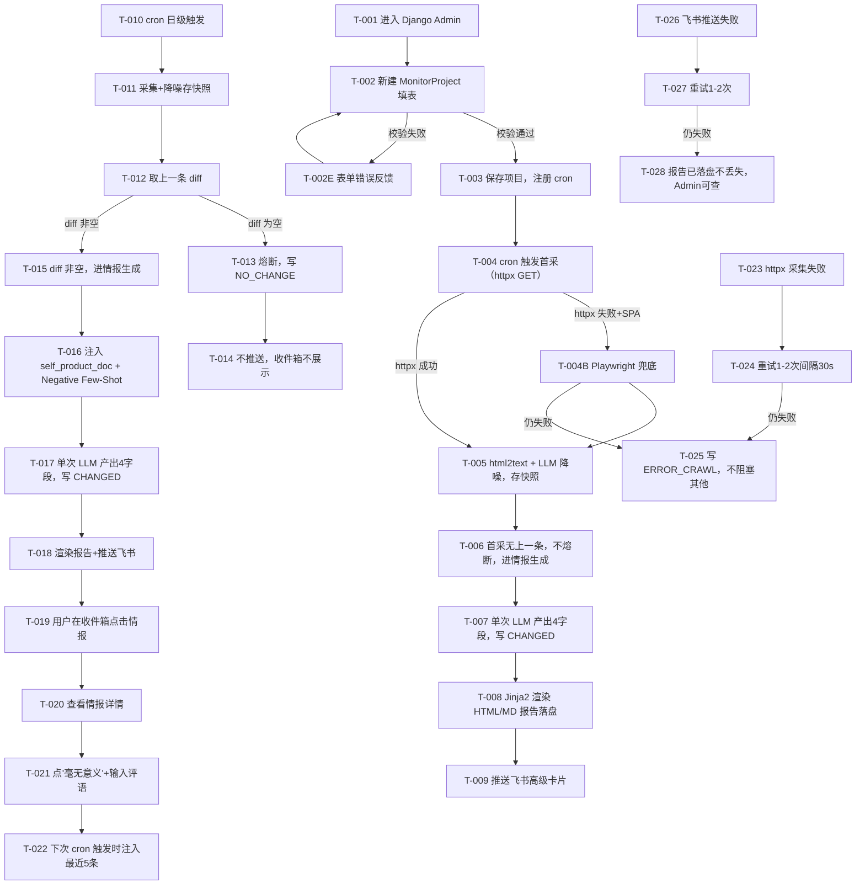

> 目的：把 `requirements/prd.md` 的核心场景/规则/AC，转写为可走查、可评审、可验证的交互说明，消除实现与验收歧义（不做视觉稿）。
>
> 规则：结论优先；只写会影响实现/验收的最小信息；本文档中不出现"待确认问题"清单——所有不确定性统一引用 PRD/solution 的"验证清单"（Owner/截止/动作明确）。

## 0. 基本信息

- 需求标识（分支 / ID）：001-competitive-intel-agent
- 作者 / 参与评审：FS（作者）；PM（评审）；Leader（评审）
- 状态：draft
- 最后更新：2026-07-07
- Figma 链接入口：无（MVP 用 ASCII 线框，不另出视觉稿）

---

## 1. 场景清单（与 PRD 对齐，必填）

| 场景编号 | 场景标题（用户视角） | 成功标准（1–3 条） | 任务流节点（T-xxx…） | 页面链路摘要（P-xxx → …） | PRD 对应 AC |
|---|---|---|---|---|---|
| S-001 | 首次配置并触发首次采集 | ① cron 触发首采；② 首采不熔断直接生成情报；③ 飞书收到卡片 | T-001~T-009 | P-001 → P-002 → P-005 → D-001 | AC-001~AC-005 |
| S-002 | 日常日级采集 + 无变化熔断 | ① diff 空不调 LLM；② 写 NO_CHANGE；③ 不推送 | T-010~T-014 | P-002（后台） | AC-006~AC-009 |
| S-003 | 有变化 + 反馈注入下次推理 | ① diff 非空生成情报推送；② 用户点毫无意义+评语；③ 下次注入最近5条 | T-015~T-022 | P-003 → P-004 → D-001 → P-004 | AC-010~AC-013 |
| S-004 | 采集失败/SPA 兜底/推送失败（异常路径） | ① 失败写 ERROR_CRAWL；② 不阻塞其他 URL；③ 报告不丢失 | T-023~T-028 | P-002（后台） | AC-014~AC-017 |

---

## 2. 端到端任务流（必填）

> 节点编号：T-001…；页面 P-001…；弹窗 D-001…；反馈 F-001…



---

## 3. 页面/弹窗清单（必填）

| Node ID | 类型（P/D/W） | 名称/目的 | 入口（从哪里来） | 覆盖任务流节点（T-xxx…） | 覆盖场景 | 备注 |
|---|---|---|---|---|---|---|
| P-001 | P | Django Admin - MonitorProject 配置页 | Django Admin 导航 | T-001,T-002,T-002E,T-003 | S-001 | 新增/编辑项目 |
| P-002 | P | Django Admin - IntelligenceFeed 列表页（调度日志） | Django Admin 导航 | T-013,T-014,T-025,T-028 | S-002,S-004 | 含 NO_CHANGE/ERROR_CRAWL 筛选 |
| P-003 | P | 独立 HTML - 收件箱列表页（仅 CHANGED） | 浏览器访问 `/` | T-019 | S-003 | 不展示 NO_CHANGE/ERROR_CRAWL |
| P-004 | P | 独立 HTML - 情报详情页（含反馈） | P-003 点击条目 | T-020,T-021,T-022 | S-003 | 含"毫无意义"按钮+评语框 |
| P-005 | P | 独立 HTML - HTML 报告预览页 | P-004 / 飞书卡片按钮 | T-008,T-009 | S-001 | `/view/html/{id}` |
| D-001 | D | 飞书高级卡片（非传统页面，作为交互节点） | 飞书群机器人推送 | T-009,T-018 | S-001,S-003 | 含预览/下载按钮 |

---

## 4. 页面说明（逐页，必填）

### 4.1 P-001 Django Admin - MonitorProject 配置页

#### 4.1.1 入口与目的

- **ID**：P-001
- **页面目的**：用户新建/编辑监控项目，配置竞品 URL、产品锚定文档、飞书 webhook、调度 cron
- **入口**：Django Admin 侧边栏 → "Monitor Projects" → "Add" / 点某条记录编辑
- **前置条件**：用户已登录 Django Admin（超级用户）；单用户场景（不变量-单用户）
- **涉及场景**：S-001

#### 4.1.2 ASCII 线框

```text
P-001 Django Admin - MonitorProject 配置页
+--------------------------------------------------------------------+
| Django Admin [Monitor Projects > Add Monitor Project]              |
+--------------------------------------------------------------------+
| Project name:                                                      |
| [______________________________________]                           |
|                                                                    |
| Competitor urls: (JSON array, each {"url":"...","title":"..."})    |
| [{"url":"https://a.com","title":"A官网"},                          |
|  {"url":"https://b.com","title":"B官网"}]                          |
| [______________________________________________________]           |
| <错误提示位置：JSON 格式校验失败时>                                 |
|                                                                    |
| Manual txt source:                                                 |
| [______________________________________________________]           |
| (用户手动粘贴的离线竞品背景资料，可选)                              |
|                                                                    |
| Imported md file:                                                  |
| [选择文件...]  当前: storage/uploads/anchor.md                    |
|                                                                    |
| Self product doc:                                                  |
| [______________________________________________________]           |
| (我方产品说明，Nullable；允许为空只上传文件)                        |
|                                                                    |
| Feishu webhook:                                                    |
| [https://open.feishu.cn/open-apis/bot/v2/hook/______]             |
| <错误提示位置：URL 格式校验失败时>                                  |
|                                                                    |
| Cron:                                                              |
| [0 9 * * *___________]  (django-apscheduler cron 表达式)          |
| <错误提示位置：cron 语法校验失败时>                                 |
|                                                                    |
| Refined rules: (P1 placeholder, MVP 不写入)                        |
| [______________________________________________________]           |
|                                                                    |
| Is active: [x]                                                     |
|                                                                    |
| Created at: 2026-07-07 10:00:00  (只读，自动生成)                   |
|                                                                    |
| 操作: [保存] [保存并继续编辑] [保存并新增] [删除]                   |
+--------------------------------------------------------------------+
```

#### 4.1.3 关键状态与反馈

| 状态 | 触发条件 | 界面要点 | 恢复路径 |
|---|---|---|---|
| 正常 | 表单填写中 | 字段可编辑，JSON/cron/webhook 实时校验 | — |
| 校验失败 | competitor_urls 非 JSON / 缺 url 或 title / cron 语法错 / webhook URL 格式错 | 字段下方红字提示错误原因 | 修正后重新提交 |
| 保存成功 | 校验通过 | Django Admin 绿色横幅"was added successfully"；django-apscheduler 注册 cron | 跳转列表页或继续编辑 |
| 删除确认 | 点"删除" | 二次确认页"Are you sure?" | 确认删除 / 取消 |

#### 4.1.4 关键校验与错误处理

- **校验-1**：`competitor_urls` 必须是合法 JSON 数组，每项必有 `url`（非空字符串）和 `title`（非空字符串）。失败提示："Competitor urls must be a JSON array of {url, title} objects"（不变量11）
- **校验-2**：`cron` 必须符合 django-apscheduler cron 语法。失败提示："Invalid cron expression"（不变量9）
- **校验-3**：`feishu_webhook` 必须是合法 URL。失败提示："Enter a valid URL"
- **校验-4**：`self_product_doc` Nullable 允许为空（DB-2 裁决），但建议填写或上传文件

#### 4.1.5 跳转与交互

- **保存成功后**：跳转 Django Admin MonitorProject 列表页；django-apscheduler 注册该 cron 任务
- **校验失败后**：停留在当前页，保留输入，字段下方显示错误
- **删除**：二次确认 → 确认后删除项目（CASCADE 删除关联 DataSnapshot/IntelligenceFeed）

---

### 4.2 P-002 Django Admin - IntelligenceFeed 列表页（调度日志）

#### 4.2.1 入口与目的

- **ID**：P-002
- **页面目的**：查看所有情报记录（含 CHANGED/NO_CHANGE/ERROR_CRAWL），用于排障与调度日志查看
- **入口**：Django Admin 侧边栏 → "Intelligence Feeds"
- **前置条件**：用户已登录 Django Admin
- **涉及场景**：S-002, S-004

#### 4.2.2 ASCII 线框

```text
P-002 Django Admin - IntelligenceFeed 列表页
+--------------------------------------------------------------------+
| Django Admin [Intelligence Feeds]                                  |
+--------------------------------------------------------------------+
| [筛选栏]                                                           |
| By project: [全部 v]  By job_status: [全部 v]  [筛选] [重置]      |
|                                                                    |
| ID  | Project       | Execution time      | Job status  | Feedback |
|-----|---------------|---------------------|-------------|----------|
| 42  | AI IDE 监控   | 2026-07-07 09:00:03 | CHANGED     | 0        |
| 41  | AI IDE 监控   | 2026-07-06 09:00:05 | NO_CHANGE   | 0        |
| 40  | AI IDE 监控   | 2026-07-05 09:00:10 | ERROR_CRAWL | 0        |
| 39  | AI IDE 监控   | 2026-07-04 09:00:02 | CHANGED     | -1       |
|                                                                    |
| [选中对象: 删除选中]                                               |
| 123 records. Page 1 of 13.  [上一页] [下一页]                      |
+--------------------------------------------------------------------+
```

#### 4.2.3 关键状态与反馈

| 状态 | 触发条件 | 界面要点 | 恢复路径 |
|---|---|---|---|
| 正常 | 有记录 | 列表展示，可按 project/job_status 筛选 | — |
| 空 | 无记录 | "No records found" | 在 P-001 新建项目触发采集 |
| 筛选中 | 选 job_status=NO_CHANGE | 仅展示熔断记录 | 重置筛选 |

#### 4.2.4 关键校验与错误处理

- 无编辑校验（只读列表）；点记录进详情可查看 `log_message`（ERROR_CRAWL 的错误详情）

#### 4.2.5 跳转与交互

- **点击记录**：进入 IntelligenceFeed 详情页（Django Admin 内置详情页，展示所有字段含 `log_message`/`html_report_path`/`md_table_path`）
- **筛选**：按 project / job_status 筛选

---

### 4.3 P-003 独立 HTML - 收件箱列表页（仅 CHANGED）

#### 4.3.1 入口与目的

- **ID**：P-003
- **页面目的**：用户浏览有变化的情报列表（收件箱），仅展示 `job_status=CHANGED`（不变量7）
- **入口**：浏览器访问 `/`（独立 HTML 网页入口）
- **前置条件**：已有 CHANGED 记录；无则展示空状态
- **涉及场景**：S-003

#### 4.3.2 ASCII 线框

```text
P-003 收件箱列表页（仅 CHANGED）
+--------------------------------------------------------------------+
| 竞争情报收件箱                                          [刷新]      |
+--------------------------------------------------------------------+
| [情报卡片]                                                         |
|--------------------------------------------------------------------|
| #42  AI IDE 监控   2026-07-07 09:00                                |
| 变化摘要: <change_summary 前 200 字预览...>                       |
| [查看详情]                                                         |
|--------------------------------------------------------------------|
| #39  AI IDE 监控   2026-07-04 09:00                    [已反馈 👎] |
| 变化摘要: <change_summary 前 200 字预览...>                       |
| [查看详情]                                                         |
|--------------------------------------------------------------------|
|                                                                    |
| <空状态：暂无有变化的情报，系统每日自动检查>                       |
|                                                                    |
| 页脚: 由 django-apscheduler 日级调度 · 不变量9                     |
+--------------------------------------------------------------------+
```

#### 4.3.3 关键状态与反馈

| 状态 | 触发条件 | 界面要点 | 恢复路径 |
|---|---|---|---|
| 正常 | 有 CHANGED 记录 | 卡片列表，每条含 ID/项目/时间/摘要预览/查看按钮 | — |
| 空 | 无 CHANGED 记录 | "暂无有变化的情报，系统每日自动检查" | 等待下次 cron |
| 加载 | 页面加载中 | 骨架屏或"加载中..." | 自动消失 |

#### 4.3.4 关键校验与错误处理

- 无编辑校验；仅展示 `job_status=CHANGED`（NO_CHANGE/ERROR_CRAWL 不展示，不变量7）

#### 4.3.5 跳转与交互

- **点击"查看详情"**：跳转 P-004 情报详情页 `/view/intel/{id}`
- **已反馈标记**：若 `user_feedback != 0`，卡片右上角显示 👍/👎 标记

---

### 4.4 P-004 独立 HTML - 情报详情页（含反馈）

#### 4.4.1 入口与目的

- **ID**：P-004
- **页面目的**：展示情报 4 字段详情，提供反馈入口（"毫无意义"+评语）
- **入口**：P-003 点击"查看详情" → `/view/intel/{intelligence_id}`
- **前置条件**：该 IntelligenceFeed 记录存在且 `job_status=CHANGED`
- **涉及场景**：S-003

#### 4.4.2 ASCII 线框

```text
P-004 情报详情页
+--------------------------------------------------------------------+
| < #42  AI IDE 监控   2026-07-07 09:00                              |
+--------------------------------------------------------------------+
| 变化摘要 (Change Summary):                                         |
|--------------------------------------------------------------------|
| <change_summary 全文，含证据 diff 嵌入（DB-1 裁决）>              |
|                                                                    |
+--------------------------------------------------------------------+
| 战略意图 (Strategic Intent):                                       |
|--------------------------------------------------------------------|
| <strategic_intent 全文>                                           |
|                                                                    |
+--------------------------------------------------------------------+
| 行动建议 (Action Suggestions):                                     |
|--------------------------------------------------------------------|
| <action_suggestions JSON 数组渲染>                                 |
| [Priority: High] 建议1...                                          |
| [Priority: Med]  建议2...                                          |
|                                                                    |
+--------------------------------------------------------------------+
| 报告下载: [在线预览 HTML]  [下载 MD 表格]                         |
+--------------------------------------------------------------------+
| 反馈区:                                                            |
|--------------------------------------------------------------------|
| 这条情报对您有价值吗？                                             |
| [👍 极具价值]  [👎 毫无意义]                                      |
|                                                                    |
| <评语输入框（点👎后展开）>                                         |
| [______________________________________________________]           |
| [提交反馈]                                                         |
|                                                                    |
| <反馈成功提示：感谢反馈，将用于改进下次情报生成>                   |
+--------------------------------------------------------------------+
```

#### 4.4.3 关键状态与反馈

| 状态 | 触发条件 | 界面要点 | 恢复路径 |
|---|---|---|---|
| 正常 | 进入详情页 | 展示 4 字段 + 反馈区 | — |
| 已反馈 | user_feedback=1 | 👍 按钮高亮，评语框不展示 | 可重新点击切换 |
| 已反馈负 | user_feedback=-1 | 👎 按钮高亮，评语框展示已提交评语 | 可编辑评语重新提交 |
| 提交成功 | 反馈提交 | "感谢反馈，将用于改进下次情报生成" | 停留当前页 |
| 提交失败 | 网络错误 | "提交失败，请重试" | 重试按钮 |
| 记录不存在 | URL id 无效 | 404 页面 | 返回 P-003 |

#### 4.4.4 关键校验与错误处理

- **校验-1**：点"毫无意义"后评语框展开，`user_comment` 可空（点按钮即可提交，评语可选）
- **校验-2**：反馈提交 POST 到 `/api/feedback/{intelligence_id}`，需校验 intelligence_id 存在且 `job_status=CHANGED`

#### 4.4.5 跳转与交互

- **点"在线预览 HTML"**：新窗口打开 P-005 `/view/html/{intelligence_id}`
- **点"下载 MD 表格"**：触发下载 `md_table_path` 文件
- **提交反馈成功后**：停留当前页，反馈区更新为已反馈状态
- **返回**：点"<"返回 P-003 收件箱

---

### 4.5 P-005 独立 HTML - HTML 报告预览页

#### 4.5.1 入口与目的

- **ID**：P-005
- **页面目的**：展示 Jinja2 渲染的 HTML 报告（情报 4 字段的完整排版）
- **入口**：P-004 点"在线预览" / 飞书卡片 D-001 点"在线预览"按钮 → `/view/html/{intelligence_id}`
- **前置条件**：该 IntelligenceFeed 记录存在且 `html_report_path` 文件存在
- **涉及场景**：S-001, S-003

#### 4.5.2 ASCII 线框

```text
P-005 HTML 报告预览页
+--------------------------------------------------------------------+
| 竞争情报报告 #42                          [返回收件箱]             |
+--------------------------------------------------------------------+
| 项目: AI IDE 监控    生成时间: 2026-07-07 09:00                    |
+--------------------------------------------------------------------+
| 一、变化摘要                                                       |
|--------------------------------------------------------------------|
| <change_summary 全文，含证据 diff>                                |
|                                                                    |
+--------------------------------------------------------------------+
| 二、战略意图解读                                                   |
|--------------------------------------------------------------------|
| <strategic_intent 全文>                                           |
|                                                                    |
+--------------------------------------------------------------------+
| 三、行动建议                                                       |
|--------------------------------------------------------------------|
| <action_suggestions 渲染>                                         |
|                                                                    |
+--------------------------------------------------------------------+
| 四、证据 Diff                                                      |
|--------------------------------------------------------------------|
| <diff 片段，嵌入在 change_summary 或单独渲染>                     |
|                                                                    |
+--------------------------------------------------------------------+
| [返回收件箱]  [下载 MD]                                            |
+--------------------------------------------------------------------+
```

#### 4.5.3 关键状态与反馈

| 状态 | 触发条件 | 界面要点 | 恢复路径 |
|---|---|---|---|
| 正常 | 文件存在 | 展示报告内容 | — |
| 文件丢失 | html_report_path 文件不存在 | "报告文件不存在，请检查存储" | 返回 P-003 |
| 记录不存在 | URL id 无效 | 404 | 返回 P-003 |

#### 4.5.4 关键校验与错误处理

- 无编辑校验（只读预览页）

#### 4.5.5 跳转与交互

- **返回收件箱**：跳转 P-003
- **下载 MD**：触发下载 `md_table_path` 文件

---

### 4.6 D-001 飞书高级卡片（交互节点）

#### 4.6.1 入口与目的

- **ID**：D-001
- **目的**：系统推送情报到飞书群，用户在飞书内直接预览/下载
- **入口**：系统通过 `feishu_webhook` 推送（T-009/T-018）
- **前置条件**：IntelligenceFeed `job_status=CHANGED`；webhook 可达
- **涉及场景**：S-001, S-003

#### 4.6.2 ASCII 线框（飞书卡片结构）

```text
D-001 飞书高级卡片
+--------------------------------------------------------------------+
| [卡片头] 竞争情报监控 · AI IDE 监控                                |
+--------------------------------------------------------------------+
| [正文区]                                                           |
| 变化摘要:                                                          |
| <change_summary 前 500 字>                                        |
|                                                                    |
| 战略意图: <strategic_intent 前 200 字>                            |
|                                                                    |
| 生成时间: 2026-07-07 09:00                                         |
+--------------------------------------------------------------------+
| [按钮区]                                                           |
| [在线预览 HTML]  -> 跳转 /view/html/{id}                           |
| [下载 MD 表格]  -> 下载 md_table_path                             |
+--------------------------------------------------------------------+
```

#### 4.6.3 关键状态与反馈

| 状态 | 触发条件 | 界面要点 | 恢复路径 |
|---|---|---|---|
| 推送成功 | 飞书 API 返回成功 | 卡片出现在群聊 | — |
| 推送失败 | webhook 不可达/返回错误 | 重试 1-2 次；仍失败记日志 | 报告已落盘，Admin 可查（V-010） |
| 降级 Markdown | 高级卡片对接困难（V-008 触发） | 纯文本 Markdown 消息 | FS 检查卡片 API |

#### 4.6.4 关键校验与错误处理

- **校验-1**：`feishu_webhook` 必须是飞书群机器人 webhook URL（P-001 已校验）
- **异常-1**：推送失败重试 1-2 次（V-010）；情报报告已落盘不丢失

#### 4.6.5 跳转与交互

- **点"在线预览 HTML"**：浏览器打开 P-005 `/view/html/{id}`
- **点"下载 MD 表格"**：触发下载

---

## 5. AC → 交互节点映射（如 PRD 存在则必须）

| AC-ID / 描述 | 场景 | 任务流节点（T-xxx…） | 页面/节点（P/D/W-xxx） | 验证点（状态/文案/按钮可用性/跳转结果） |
|---|---|---|---|---|
| AC-001 配置保存入库 | S-001 | T-001,T-002,T-003 | P-001 | 保存成功后记录入库，is_active=TRUE，cron 注册 |
| AC-002 首采存快照 | S-001 | T-004,T-005 | P-002（后台） | DataSnapshot 新增记录，append-only（UPDATE/DELETE 触发 RAISE） |
| AC-003 首采生成情报 | S-001 | T-006,T-007 | P-002（后台） | IntelligenceFeed job_status=CHANGED，4 字段非空 |
| AC-004 报告落盘 | S-001 | T-008 | P-005 | html_report_path/md_table_path 文件存在 |
| AC-005 飞书卡片 | S-001 | T-009 | D-001 | 飞书群收到卡片，按钮可跳转 P-005 |
| AC-006 diff 空不调 LLM | S-002 | T-012,T-013 | P-002（后台） | 日志可证零 LLM 调用 |
| AC-007 写 NO_CHANGE | S-002 | T-013 | P-002 | IntelligenceFeed job_status=NO_CHANGE，收件箱 P-003 不展示 |
| AC-008 Admin 可查 NO_CHANGE | S-002 | T-014 | P-002 | Admin 列表含 NO_CHANGE，可筛选 |
| AC-009 飞书无推送 | S-002 | T-014 | D-001 | 飞书群无消息 |
| AC-010 diff 非空生成情报 | S-003 | T-015~T-018 | P-004,D-001 | job_status=CHANGED，4 字段非空，飞书推送 |
| AC-011 反馈持久化 | S-003 | T-021 | P-004 | user_feedback=-1，user_comment 存入 |
| AC-012 下次注入最近5条 | S-003 | T-022 | P-004（下次生成） | 注入条数 ≤5，prompt 不超窗口 |
| AC-013 注入后不产出无意义情报 | S-003 | T-022 | P-004 | V-018 成功信号 |
| AC-014 采集失败写 ERROR_CRAWL | S-004 | T-023~T-025 | P-002 | job_status=ERROR_CRAWL，log_message 有详情，不阻塞其他 |
| AC-015 推送失败报告不丢 | S-004 | T-026~T-028 | P-002,P-005 | job_status 仍 CHANGED，报告文件存在 |
| AC-016 SPA 兜底 | S-004 | T-004B | P-002（后台） | Playwright 拿到内容后正常链路；仍失败按 AC-014 |
| AC-017 append-only 硬约束 | S-004 | — | P-002（DB 层） | SQL UPDATE/DELETE 触发 RAISE ABORT |

---

## 6. 走查/验证脚本（必须）

### 6.1 覆盖的验证清单条目（引用 `solution.md/prd.md`）

- V-001：社媒 SPA httpx 兜底（Playwright 降级）
- V-002：官网关键页面选择（用户配置 1-N URL）
- V-003：diff 粒度（全文文本，噪音过滤 >80%）
- V-004：LLM prompt 准确性（降噪+情报生成）
- V-006：采集失败重试（1-2 次，间隔 30s）
- V-008：飞书高级卡片格式
- V-010：飞书推送失败降级
- V-011：快照存储格式（降噪后 Markdown）
- V-016：产品锚定文档解析与注入
- V-017：产品锚定对建议质量提升
- V-018：Negative Few-Shot 注入策略（最近 5 条）

### 6.2 任务脚本（按场景）

**任务-1（S-001 首次配置+首采）**

- 任务目标：验证用户配置后 cron 首采全链路打通
- 关键步骤：
  1. 在 P-001 新建 MonitorProject，填入 2 个竞品 URL + self_product_doc + webhook + cron `0 9 * * *`
  2. 等待 cron 触发（或手动触发）
  3. 验证 P-002 有新增 CHANGED 记录
  4. 验证 DataSnapshot 新增 2 条（append-only）
  5. 验证飞书群 D-001 收到卡片
  6. 点卡片"在线预览"跳转 P-005
- 成功标准：AC-001~AC-005 全通过
- 观察点：append-only 触发器是否生效（AC-017）；4 字段是否非空；飞书按钮是否可跳转

**任务-2（S-002 无变化熔断）**

- 任务目标：验证 diff 为空时熔断，不推送不生成情报
- 关键步骤：
  1. 对已采集过的竞品 URL，内容未变化时触发 cron
  2. 验证 P-002 新增 NO_CHANGE 记录
  3. 验证收件箱 P-003 不展示该记录
  4. 验证飞书群无推送
  5. 验证 LLM 调用日志为零（AC-006）
- 成功标准：AC-006~AC-009 全通过
- 观察点：是否真的零 LLM 调用（成本约束，不变量4）

**任务-3（S-003 有变化+反馈注入）**

- 任务目标：验证反馈闭环——用户负反馈直接影响下次 LLM 推理
- 关键步骤：
  1. 触发有变化的采集，验证 P-003 收件箱有新条目
  2. 点"查看详情"进 P-004，查看 4 字段
  3. 点"毫无意义"，输入评语"没有可执行性"，提交
  4. 触发下次 cron，验证 LLM prompt 含最近 5 条负反馈
  5. 验证新情报不含类似被标记的内容
- 成功标准：AC-010~AC-013 全通过
- 观察点：注入条数 ≤5（不变量12）；prompt 不超上下文窗口（V-018）

**任务-4（S-004 异常路径）**

- 任务目标：验证采集失败/推送失败的容错
- 关键步骤：
  1. 配置一个不可达 URL，触发采集
  2. 验证重试 1-2 次后写 ERROR_CRAWL（P-002 可查）
  3. 验证其他竞品 URL 不受影响
  4. 配置一个无效飞书 webhook，触发有变化情报
  5. 验证推送失败后报告已落盘（P-005 可访问）
  6. 配置一个 SPA 社媒 URL，验证 Playwright 兜底
- 成功标准：AC-014~AC-017 全通过
- 观察点：不阻塞其他 URL（AC-014）；报告不丢失（AC-015）；Playwright 兜底是否生效（AC-016）

### 6.3 记录方式（问题清单模板）

| 问题 | 严重度（S1/S2/S3） | 复现步骤 | 影响范围（场景/页面/AC） | 建议修复方向 |
|---|---|---|---|---|
|  |  |  |  |  |

### 6.4 结论与回流

- 结论摘要：4 场景 17 AC 全部有页面/节点映射；异常路径覆盖采集失败/推送失败/SPA 兜底/append-only 硬约束
- 需要回流更新的文件：
  - `requirements/prd.md`（若走查发现 AC 缺口或规则需补充）
  - `requirements/prototype.md`（若走查发现页面/状态/跳转需调整）
  - `requirements/solution.md`（若走查发现边界/不变量需修订）

---

## 7. 追溯链接（Evidence & References）

- PRD：`requirements/prd.md`（§3 场景 S-001~S-004 / §6 AC-001~AC-017 / §5 规则-1~13 / §8 验证清单 V-001~V-018）
- Solution：`requirements/solution.md`（§2 推荐方案6步 / §7.2 不变量1-13 / §6 迭代记录 DB-1~DB-4b 裁决）
- Raw：`requirements/raw.md`（UR-1~UR-7 / Q1-Q8 澄清 / 修订-1~修订-5）
- 术语与口径：`project/memory/glossary.md`（无，标注为 CONTEXT GAP）

---

## 8. R3-DoD 自检（完成标准）

- [x] 交互内容与 PRD 的场景/规则/AC 一一对应（4 场景 17 AC 全覆盖）
- [x] 任务流、节点清单与页面清单一致（T-001~T-028 → P-001~P-005 + D-001）
- [x] 每个页面至少包含：入口、ASCII 线框、状态、跳转（6 个节点全含）
- [x] 关键状态覆盖完整（正常/加载/空/错/无权限；提交类含成功/失败反馈）
- [x] 高风险/不可逆操作含二次确认（P-001 删除二次确认）
- [x] 与 PRD 的 AC 可追溯（§5 AC → 交互节点映射表 17 条全覆盖）
- [x] 至少包含一份"走查/验证脚本"章节（§6 含 4 任务脚本 + 回流指引）
