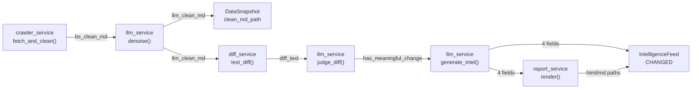

目的：产出可评审的**决策文档（RFC/Decision Doc）**，作为 implementation 的权威输入。不写"待确认问题/TODO"；未知统一进入第 6 节风险与验证清单。

落盘位置：`{FEATURE_DIR}/design/design.md`

## 0. 基本信息

- 需求标识（分支 / ID）：004-llm-intel-pipeline
- 标题：LLM 系统接入与竞品分析全流程 — 设计决策 + Prompt 体系
- 作者：FS
- 评审人：PM
- 状态：draft
- 最后更新：2026-07-08
- 关联链接：`requirements/solution.md`、`requirements/prd.md`、`requirements/raw.md`

## 1. 结论摘要

- 一句话目标：在 Spec 003 采集调度层之上新增 LLM 服务层（3 次独立调用）+ Prompt 体系 + Jinja2 报告渲染 + scheduler_service 集成，打通从降噪到入库的全链路。
- In / Out 边界：In = LLM 服务抽象层、5 套 Prompt 模板、混合 diff 熔断、instructor 情报生成、IntelligenceFeed 入库、Jinja2 报告、scheduler 集成；Out = 飞书推送、前端变更、多 provider、异步队列。
- 推荐方案：BS→LLM 叠加降噪 + 3 次独立 LLM 调用 + 混合 diff 熔断 + instructor 结构化情报 + Jinja2 报告落盘。
- 关键取舍：BS 去噪保留作为 LLM 降噪前置；clean_md_path 覆盖存储无需 migration；LLM 失败重试不降级。
- 优先验证点：R1（Prompt 降噪效果）、R3（混合 diff 熔断准确率）、R5（instructor 结构化输出可靠性）。

## 2. 范围与边界

- 系统边界：从 `crawler_service.fetch_and_clean()` 返回 `(raw_html, bs_clean_md)` 开始，到 `IntelligenceFeed` 入库 + 报告文件落盘结束。crawler_service 不改。
- 影响面：scheduler_service 扩展（串接 LLM 链路）；DataSnapshot.clean_md_path 语义变更（BS→LLM）；新增 llm_service / report_service / diff_service 三个服务模块；settings.py 新增 LLM 配置；requirements 新增依赖。
- 明确不做什么：飞书推送；前端页面变更；Django Admin 变更；多 LLM provider；异步队列；refined_rules 写入。
- 不变量：
  1. 3 次 LLM 调用独立，不合并（Invariant #2 修订）
  2. 情报生成仅在 LLM diff 判断有意义时触发（Invariant #3 修订）
  3. 情报输出固定 4 字段，不含价值度（Invariant #4 不变）
  4. Negative Few-Shot 最近 5 条（Invariant #11 不变）
  5. DataSnapshot 字段只存路径不存内容（models Invariant #9 不变）
  6. LLM 密钥从 .env 读取，不硬编码不入库

## 3. 推荐方案（按 C4 L1–L3）

### 3.1 C4-L1：System Context（系统上下文）

- 用户/角色：调度器（django-apscheduler 自动触发）；开发者（手动触发测试）
- 外部系统：OpenAI 兼容 LLM API（OpenAI / DeepSeek / 通义 / Moonshot）
- 系统边界：采集后 BS 去噪 MD → LLM 链路 → IntelligenceFeed + 报告文件
- 关键交互与主要输入输出：



- 关键约束：3 次 LLM 调用各自独立重试；同步执行不引入队列

### 3.2 C4-L2：Container（容器/部署单元）

- 容器清单：
  - Django 单体（已有，扩展）：scheduler_service 串接 LLM 链路
  - SQLite（已有）：DataSnapshot + IntelligenceFeed
  - 文件系统（已有）：SNAPSHOT_STORAGE_DIR 存快照文件 + 报告产物
  - LLM API（外部）：OpenAI 兼容接口
  - .env 文件（新增）：LLM 配置
- 每个容器职责与主要技术选型：
  - llm_service（新增）：封装 3 次 LLM 调用（降噪/diff判断/情报生成），instructor + Pydantic 用于情报生成，普通文本补全用于降噪和 diff 判断
  - diff_service（新增）：difflib 文本 diff + 截断控制
  - report_service（新增）：Jinja2 渲染 HTML/MD 报告
  - prompts/ 目录（新增）：5 套 Prompt 模板文件
- 关键数据流：

```
scheduler.run_scan()
  → crawler_service.fetch_and_clean(url)          [已有，不改]
  → llm_service.denoise(bs_clean_md)               [第1次LLM] → 覆盖写入 clean_md_path
  → DataSnapshot 入库                              [已有，不改]
  → diff_service.text_diff(new_md, prev_md)        [文本diff]
  → if diff empty: IntelligenceFeed(NO_CHANGE)     [熔断]
  → llm_service.judge_diff(diff_text, self_doc)    [第2次LLM]
  → if no meaningful change: IntelligenceFeed(NO_CHANGE) [熔断]
  → llm_service.generate_intel(diff, self_doc, few_shots) [第3次LLM, instructor]
  → IntelligenceFeed(CHANGED) + 4 fields 入库
  → report_service.render(feed) → html/md 落盘 → 路径回写
```

- 对外契约入口：无新增 API，无前端变更

### 3.3 C4-L3：Component（组件）

#### 3.3.1 llm_service 组件拆分

- `llm_client.py`：OpenAI 兼容 client 封装，从 settings 读取 api_key/base_url/model/temperature/max_tokens
- `denoise_service.py`：`denoise(bs_clean_md) -> str`，普通文本补全，Prompt=`prompts/denoise.md`
- `diff_judge_service.py`：`judge_diff(diff_text, self_product_doc) -> {has_meaningful_change, reason}`，普通文本补全，Prompt=`prompts/diff_judge.md`
- `intel_service.py`：`generate_intel(diff_text, self_product_doc, few_shots) -> IntelResult`，instructor + Pydantic，Prompt=`prompts/intel_system.md` + `prompts/intel_user.md`
- `retry.py`：通用重试装饰器，2-3 次重试，间隔 30s，重试耗尽 raise LLMError

#### 3.3.2 Pydantic Schema（情报生成输出约束）

```python
class IntelResult(BaseModel):
    change_summary: str        # 变化摘要
    strategic_intent: str      # 战略意图
    action_suggestion: str     # 行动建议
    evidence_diff: str         # 证据 diff（嵌入摘要或报告素材，不独立为 DB 列）
```

#### 3.3.3 diff_service 组件拆分

- `text_diff_service.py`：`text_diff(new_md, prev_md) -> str`，difflib.unified_diff
- 截断策略：diff 输出超过 8000 字符时截断，保留头部 + 尾部 + 中间摘要

#### 3.3.4 report_service 组件拆分

- `render_service.py`：`render_html(feed) -> str path`、`render_md(feed) -> str path`
- Jinja2 模板：`templates/report.html.j2`、`templates/report.md.j2`
- 落盘路径：`SNAPSHOT_STORAGE_DIR/reports/{project_id}/{date}/{feed_id}.html|md`

#### 3.3.5 错误处理与一致性策略

- LLM 调用失败：重试 2-3 次（间隔 30s），耗尽写 `IntelligenceFeed(ERROR_CRAWL)`，错误信息存 `change_summary`
- 采集失败：写 `IntelligenceFeed(ERROR_CRAWL)`，不进入 LLM 链路
- 单 URL 异常不中断其他 URL：try-catch 包裹每个 URL 的 LLM 链路
- 首次爬取：无上一条快照 → 跳过 diff（步骤 3-4），直接情报生成
- 旧格式快照：上一条为 BS 结果（pre-LLM）→ 跳过 diff 直接情报生成

### 3.4 Prompt 体系设计（核心决策）

> 用户明确要求设计 4 套 Prompt：系统提示词、过滤降噪提示词、分析提示词、产出提示词。
> 实际拆为 5 套（分析拆为 system + user 两套），全部存放在 `prompts/` 目录，文件系统存储。

#### Prompt 1：数据清洗/过滤降噪 Prompt（`prompts/denoise.md`）

**用途**：第 1 次 LLM 调用，输入 BS 去噪后 MD，输出 LLM 语义降噪后 MD

**设计要点**：
- 角色：专业的内容编辑，负责从网页提取核心信息
- 输入：BS 去噪后的 markdown（已去 nav/footer/script，但仍含模板噪音、广告残留、重复内容）
- 输出：结构化 markdown，去除噪音保留核心语义
- 约束：不编造内容；保留原文语言；保留关键数字/链接/产品名

**模板结构**：

```markdown
你是一个专业的内容编辑。你的任务是对以下网页 markdown 进行语义降噪。

## 规则

1. 去除广告、导航链接、版权声明、cookie 提示等模板噪音
2. 去除重复段落和空白填充内容
3. 保留核心产品介绍、功能描述、价格信息、更新日志等有价值内容
4. 保留原文语言（中文保留中文，英文保留英文）
5. 保留关键数字、链接、产品名称
6. 不编造或补充原文中没有的内容
7. 保持 markdown 格式整洁

## 输入

{bs_clean_md}

## 输出

直接输出降噪后的 markdown，不要添加额外说明。
```

**变量注入**：`{bs_clean_md}` → crawler_service 返回的 BS 去噪 MD

#### Prompt 2：diff 判断 Prompt（`prompts/diff_judge.md`）

**用途**：第 2 次 LLM 调用，输入文本 diff + self_product_doc，输出是否有实质变化

**设计要点**：
- 角色：竞品分析专家，判断变化是否有分析价值
- 输入：文本 diff 片段 + self_product_doc（产品锚定上下文）
- 输出：结构化 JSON `{has_meaningful_change: bool, reason: str}`
- 约束：只关注与产品竞争相关的实质变化；忽略排版/样式/日期等非实质变化

**模板结构**：

```markdown
你是一个竞品分析专家。你的任务是判断以下竞品网站的变化是否有分析价值。

## 我方产品上下文

{self_product_doc}

## 竞品变化 diff

{diff_text}

## 判断规则

1. 只关注与产品竞争相关的实质变化（功能更新、价格调整、新产品发布、战略方向变化）
2. 忽略排版变化、样式调整、日期更新、cookie/隐私政策变更等非实质变化
3. 结合我方产品定位判断：这个变化是否可能影响我方竞争态势
4. 如果变化仅是措辞调整但语义不变，判断为无意义

## 输出格式

严格输出以下 JSON 格式，不要添加其他内容：

```json
{
  "has_meaningful_change": true/false,
  "reason": "简要说明判断理由（1-2句话）"
}
```
```

**变量注入**：`{self_product_doc}` → MonitorProject.self_product_doc；`{diff_text}` → diff_service.text_diff() 输出

#### Prompt 3：自家产品系统 Prompt（`prompts/intel_system.md`）

**用途**：第 3 次 LLM 调用的 system role，注入 self_product_doc 作为分析锚定

**设计要点**：
- 角色：竞争情报分析师，为我方产品提供竞争态势分析
- 上下文：我方产品锚定文档，定义我方定位/目标用户/核心功能
- 约束：分析必须结合我方产品定位；建议必须可执行；不接受空泛建议

**模板结构**：

```markdown
你是一位竞争情报分析师，专门为我方产品提供竞争态势分析。

## 我方产品锚定文档

{self_product_doc}

## 分析要求

1. 所有分析必须结合我方产品定位，不能脱离上下文给泛泛之谈
2. 行动建议必须具体可执行，明确指出我方应做什么、为什么、怎么做
3. 战略意图分析要推断竞品此举对我方的影响
4. 证据 diff 要引用实际变化内容，不能编造
```

**变量注入**：`{self_product_doc}` → MonitorProject.self_product_doc

#### Prompt 4：竞品分析 User Prompt（`prompts/intel_user.md`）

**用途**：第 3 次 LLM 调用的 user role，注入 diff 片段 + Negative Few-Shot，引导产出 4 字段

**设计要点**：
- 任务：分析竞品变化，产出 4 字段结构化情报
- 输入：有意义的 diff 片段 + Negative Few-Shot（最近 5 条被标记"毫无意义"的历史情报）
- 输出：instructor + Pydantic 约束的 4 字段
- 约束：Negative Few-Shot 作为反面教材，避免重蹈覆辙

**模板结构**：

```markdown
请分析以下竞品变化，产出竞争情报。

## 竞品变化 diff

{diff_text}

## 历史反面案例（请避免类似分析）

{negative_few_shots}

## 输出要求

请输出以下 4 个字段：

1. **变化摘要**：简述竞品发生了什么变化（1-3 句话）
2. **战略意图**：推断竞品此举的战略目的和对行业的影响
3. **行动建议**：结合我方产品定位，给出具体可执行的行动建议
4. **证据 diff**：引用实际变化的关键片段

## 输出格式

严格按 JSON 格式输出，每个字段为字符串类型：

```json
{
  "change_summary": "...",
  "strategic_intent": "...",
  "action_suggestion": "...",
  "evidence_diff": "..."
}
```
```

**变量注入**：
- `{diff_text}` → diff_service 截断后的 diff 片段
- `{negative_few_shots}` → 查询最近 5 条 `user_feedback=-1` 的 IntelligenceFeed，格式化为"摘要+评语"列表；无记录时填"暂无反面案例"

**Negative Few-Shot 格式化**：

```
### 反面案例 1
- 摘要：{change_summary}
- 用户评语（为何无意义）：{user_comment}

### 反面案例 2
...
```

#### Prompt 5：输出结果约束（instructor Pydantic Schema）

**用途**：通过 instructor + Pydantic 在代码层约束 LLM 输出格式，不需要单独的 Prompt 文件

**设计要点**：
- Pydantic model 定义 4 字段类型和描述
- instructor 自动将 Pydantic schema 转为 LLM 的 function calling / JSON mode 约束
- 字段描述嵌入 schema，作为 LLM 的输出指导

**Schema 定义**：

```python
from pydantic import BaseModel, Field

class IntelResult(BaseModel):
    change_summary: str = Field(
        ...,
        description="竞品变化的简要摘要，1-3句话，说明发生了什么变化"
    )
    strategic_intent: str = Field(
        ...,
        description="竞品此举的战略意图分析，对我方和行业的影响"
    )
    action_suggestion: str = Field(
        ...,
        description="结合我方产品定位的具体可执行行动建议"
    )
    evidence_diff: str = Field(
        ...,
        description="支撑分析的实际变化片段引用"
    )
```

**调用方式**：

```python
import instructor
from openai import OpenAI

client = instructor.from_openai(OpenAI(
    api_key=settings.LLM_API_KEY,
    base_url=settings.LLM_BASE_URL,
))

result = client.chat.completions.create(
    model=settings.LLM_MODEL,
    response_model=IntelResult,
    messages=[
        {"role": "system", "content": system_prompt},   # prompts/intel_system.md
        {"role": "user", "content": user_prompt},         # prompts/intel_user.md
    ],
    temperature=settings.LLM_TEMPERATURE,
    max_tokens=settings.LLM_MAX_TOKENS,
)
# result 是 IntelResult 实例，可直接访问 result.change_summary 等
```

### 3.5 关键决策与取舍

| # | 决策点 | 选择 | 取舍理由 | 若不满足前提的降级/替代 |
|---|---|---|---|---|
| D1 | Prompt 存储 | 文件系统 `prompts/` 目录 | 用户裁决（R1-Q 前确认）；不入 DB，版本管理走 git | 若需运行时编辑则迁移到 DB |
| D2 | LLM 降噪与 BS 关系 | 叠加（BS→LLM） | BS 粗筛降低 LLM 输入长度和成本；用户裁决 R1-Q1 | 若 LLM 成本极低可移除 BS 层 |
| D3 | clean_md_path 存储 | 覆盖（LLM 结果替代 BS） | 无需 migration；BS 中间态不持久化；用户裁决 R1-Q2 | 若需追溯 BS 结果则新增字段 |
| D4 | LLM 容错 | 重试 2-3 次不降级 | 保证输出质量一致性；用户裁决 R1-Q3 | 若可用性要求高则加降级 |
| D5 | 情报输出约束 | instructor + Pydantic | Spec 001 已定稿；结构化保证 4 字段完整 | 若 LLM 不支持 function calling 则降级为 JSON mode + 手动解析 |
| D6 | diff 截断阈值 | 8000 字符 | 避免 LLM token 超限；保留头尾核心变化 | V-008 验证后调整 |
| D7 | 情报生成 Prompt 拆分 | system + user 两套 | system 注入产品锚定（稳定），user 注入 diff+few-shot（动态变化） | 若 LLM 不区分 role 则合并 |

### 3.6 对外承诺要点

- 契约（API）：无新增/变更。IntelligenceFeed 有真实数据后前端消费路径天然兼容。
- 权限：无变更。
- 数据口径：`DataSnapshot.clean_md_path` 语义从"BS 去噪 MD"变为"LLM 降噪 MD"，追溯入口为 `raw.md#R1-Q2`。
- 兼容性：旧格式快照（BS 结果）在 diff 时跳过，直接情报生成（AC-017）。
- 迁移与回滚：无需 DB migration。回滚方式 = 移除 llm_service 调用，scheduler_service 回退到止步 DataSnapshot。

## 4. 与现有系统的对齐

### 4.1 契约兼容性声明（逐模块）

- **intelligence-scheduler**：
  - Service Contract：原 Invariant #5"本模块不写 IntelligenceFeed"→ 修订为"本模块串接 LLM 链路后写 IntelligenceFeed"
  - Invariant #1-4 保持不变（run_scan 触发逻辑、httpx 优先、采集失败不中断、空 URL 跳过）
  - 兼容性结论：**扩展**（run_scan 扩展后续步骤，不改前置逻辑）

- **intelligence-models**：
  - Data Contract Invariant #9"DataSnapshot 字段只存路径不存内容"→ 遵守，clean_md_path 仍存路径
  - Data Contract Invariant #10"append-only"→ 遵守，不 UPDATE/DELETE 快照
  - `clean_md_path` 语义变更（BS→LLM），但字段类型不变
  - 兼容性结论：**兼容**（字段不变，语义变更需文档记录）

- **intelligence-api**：
  - API Contract 不变：IntelligenceFeed 有真实数据后，现有 list/detail/feedback 接口天然兼容
  - 兼容性结论：**兼容**（无变更）

### 4.2 ADR 合规声明

- **ADR-001（Vue SPA + Django Split-Monolith）**：
  - 是否遵守：是
  - 本 Spec 纯后端，不涉及前端；Django 作为业务编排后端承担 LLM 调用，符合 ADR-001 的"单体后端承担 API、模型、调度与执行编排入口"

### 4.3 状态机 / 领域事件影响

- IntelligenceFeed.job_status 状态流转不变：`CHANGED` / `NO_CHANGE` / `ERROR_CRAWL`
- 新增流转路径：LLM 失败 → `ERROR_CRAWL`（原仅采集失败 → `ERROR_CRAWL`）
- 不影响幂等性：每次调度独立执行，不依赖上次 LLM 结果

### 4.4 跨模块影响确认

基于 `components/index.md` 依赖关系图：

- 上游：crawler_service（不改，接口不变）
- 下游：intelligence-api（不改，数据天然兼容）
- 交互方式：scheduler_service → llm_service（新增函数调用）；scheduler_service → report_service（新增函数调用）；scheduler_service → diff_service（新增函数调用）

## 5. 影响分析

- 上下游系统影响：无外部系统变更。LLM API 为外部依赖，通过 .env 配置管理。
- 数据口径影响：clean_md_path 语义变更，旧快照为 BS 结果，新快照为 LLM 结果。diff 需检测旧格式并跳过。
- 运行与运维影响：LLM 调用增加每次调度的耗时和成本；需监控 LLM API 可用性和调用频率。
- 迁移/回滚要点：无需 DB migration。回滚 = 移除 llm_service 调用链路，scheduler_service 回退到止步 DataSnapshot。

## 6. 风险与验证清单

| # | 风险/假设 | 验证方式 | 成功信号 | 失败信号 | Owner | 截止 | 下一步动作 |
|---|---|---|---|---|---|---|---|
| R1 | LLM 降噪叠加效果优于纯 BS | 5-10 真实站点 BS MD→LLM 降噪，人工对比 | 噪音减少>50%，核心保留>90% | 降噪质量不达标 | FS | I2 | 调 prompt 或加规则预过滤 |
| R2 | 旧格式快照兼容检测正确 | 首次运行检测旧格式→跳过 diff | 旧格式不触发错误 diff | 旧格式 diff 报错 | FS | I2 | 标记旧快照 pre-LLM |
| R3 | 混合 diff 熔断准确率合理 | 20+ 次执行结果统计 | 无意义熔断率 20-60% | 超范围 | FS | I2 | 调 diff 判断 prompt |
| R4 | LLM 重试与失败记录正确 | 模拟超时/限流场景 | 重试耗尽→写 ERROR_CRAWL | 重试逻辑异常 | FS | I2 | 增加重试次数或调间隔 |
| R5 | instructor 结构化输出可靠 | 10+ 真实 diff 测试情报生成 | 4 字段完整率>95% | 解析失败率高 | FS | I2 | 增加格式约束或 fallback |
| R6 | Negative Few-Shot 注入有效 | 有/无对比测试情报质量 | 无意义情报减少>30% | 无改善 | FS+PM | I2 | 减少条数或改摘要注入 |
| R7 | Prompt 变量注入鲁棒 | 超长/空/特殊字符测试 | 极端值不导致 LLM 错误 | LLM 返回错误或空 | FS | I2 | 增加输入清洗和长度截断 |
| R8 | diff 截断策略有效 | 测量典型 diff 长度 | 截断后不超限且核心保留 | 超限或核心丢失 | FS | I2 | 实现 diff 摘要或分段 |
| R9 | Jinja2 报告渲染正确 | 5+ 份报告验证 | HTML 无错、MD 表格正确 | 格式错误 | FS | I2 | 修正 Jinja2 模板 |
| R10 | 端到端耗时可控 | 模拟完整调度执行 | 单 URL <60s | 超时 | FS | I2 | 优化或增加超时控制 |

## 7. 追溯链接

- `{FEATURE_DIR}/requirements/solution.md`：推荐方案 + 3 备选 + 10 验证项 + #impact-analysis
- `{FEATURE_DIR}/requirements/prd.md`：3 场景 + 17 AC + 19 功能项 + 11 规则
- `{FEATURE_DIR}/requirements/raw.md`：4 轮澄清记录 + 不变量变更声明
- `project/components/index.md`：依赖关系图（scheduler→models, api→models）
- 受影响模块 `project/components/intelligence-scheduler.md`：service contract（Invariant #5 修订）
- 受影响模块 `project/components/intelligence-models.md`：data contract（Invariant #9 不变）
- 受影响模块 `project/components/intelligence-api.md`：API contract（无变更）
- `project/adr/adr-001-vue-django-split-monolith.md`：遵守
- `project/memory/tech.md`：技术栈确认
- `project/nfr.md`：NFR 基线（无 LLM NFR，R10 补充）

## 8. 迭代记录

- 2026-07-08：D2 初始化。产出设计决策文档，含 5 套 Prompt 体系设计（降噪/diff判断/系统/用户/输出约束）、C4 L1-L3 架构、7 项关键决策、10 项风险验证。新增 llm_service / diff_service / report_service 三个组件设计。
