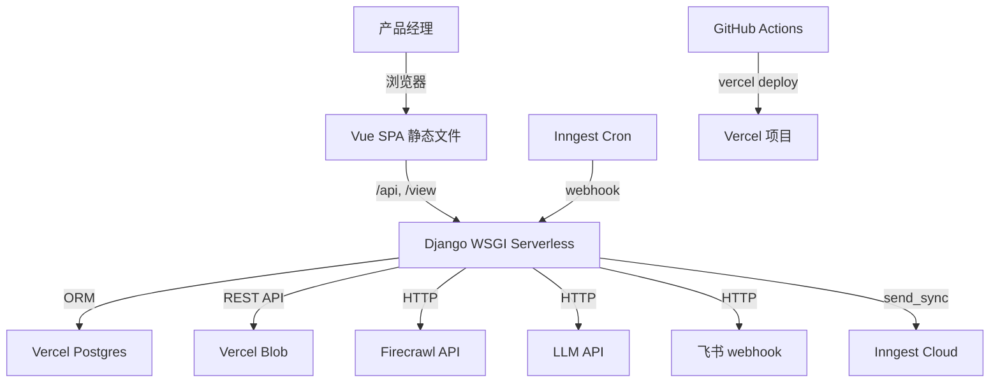
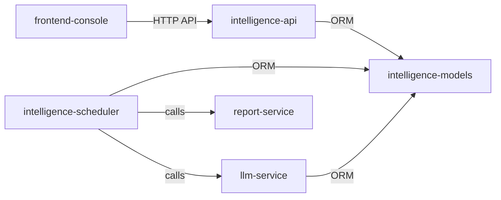

目的：产出可评审的**决策文档（RFC/Decision Doc）**，作为 implementation 的权威输入。不写"待确认问题/TODO"；未知统一进入第 6 节风险与验证清单。

落盘位置：`{FEATURE_DIR}/design/design.md`

## 0. 基本信息

- 需求标识（分支 / ID）：008-vercel-deploy
- 标题（需求名 / RFC 名）：Vercel 部署与架构适配
- 作者：Claude + 用户
- 评审人：用户
- 状态：draft
- 最后更新：2026-07-09
- 关联链接：raw.md（R1-Q1~Q8）、solution.md、research.md

## 1. 结论摘要

- 一句话目标：将 Django 单体应用部署到 Vercel，适配 serverless 架构（Postgres + Inngest + Blob + 环境变量），通过 GitHub CI/CD 自动化部署。
- In / Out 边界：In = Vercel 部署适配（Django 5.0 升级 + WSGI 适配 + Postgres + Inngest + Vercel Blob + 环境变量 + CI/CD + vercel.json）；Out = 业务功能变更、前端 UI 重构、数据迁移。
- 推荐方案：同一 Vercel 项目同域部署（Django Serverless + Vue 静态），4 个核心系统重构——Vercel Postgres 替代 SQLite、Inngest 替代 BackgroundScheduler + Threading、Vercel Blob 替代本地文件存储、环境变量配置脱敏。
- 关键取舍：升级 Django 到 5.0+（Inngest SDK 要求）；不迁移现有数据（从空表开始）；DB 字段名不变语义变更（路径 → Blob URL）。
- 优先验证点：V-009（Django 5.0 升级兼容性）、V-001（Inngest + Django webhook 集成）、V-003（Vercel Blob 读写）。

## 2. 范围与边界

- 系统边界：
  - Vercel 项目：同一项目同域部署，后端 Django WSGI Serverless Function + 前端 Vue 静态文件
  - Vercel Postgres：外部托管 Postgres 实例，通过 `DATABASE_URL` 连接
  - Inngest Cloud：外部调度服务，通过 webhook 调用 Django `/api/inngest` 端点
  - Vercel Blob：外部对象存储，通过 REST API + Bearer token 访问
  - GitHub Actions：CI/CD 流水线，push 到 dev 分支时触发

- 影响面：
  - 上下游：Inngest Cloud（新增）、Vercel Postgres（新增）、Vercel Blob（新增）、GitHub Actions（新增）
  - 数据口径：DB 字段名不变（raw_html_path / clean_md_path / html_report_path / md_table_path），语义从本地绝对路径变为 Blob URL
  - 运维：Vercel Dashboard 管理环境变量 + Inngest Dashboard 管理函数 + Vercel Blob Dashboard 管理存储

- 明确不做什么（Out）：
  - 不迁移现有 SQLite 数据到 Postgres
  - 不变更前端 UI / 交互
  - 不变更 API 路由路径和返回格式
  - 不拆分 11 步扫描链路为 Inngest 多步骤
  - 不重构 retry.py 中的重试逻辑
  - 不适配 Playwright（SPA 兜底）

- 不变量（不会改变的语义/口径/安全边界）：
  1. 3 次 LLM 调用独立，不合并（来源：`llm-service.md#invariants` #1）
  2. 情报输出固定 4 字段，不含价值度字段（来源：CLAUDE.md 不变量 #4）
  3. has_change=True → 推飞书 + 存报告；has_change=False → 熔断退出（来源：CLAUDE.md 不变量 #5）
  4. 快照 append-only——Postgres 触发器硬约束（来源：CLAUDE.md 不变量 #1，本次在 Postgres 中实现）
  5. 收件箱仅展示 job_status=CHANGED（来源：CLAUDE.md 不变量 #6）
  6. competitor_urls 必须为 JSON 数组（来源：CLAUDE.md 不变量 #10）
  7. Negative Few-Shot 注入上限最近 5 条（来源：CLAUDE.md 不变量 #11）
  8. API 路由路径不变（来源：`intelligence-api.md#invariants`）
  9. DB 字段名不变，语义从本地路径变为 Blob URL（来源：solution.md R1-Q6）

## 3. 推荐方案（按 C4 L1–L3）

### 3.1 C4-L1：System Context（系统上下文）

- 用户/角色：
  - 产品经理（单用户）：通过 Vue 前端管理监控项目、查看报告、评分
  - Inngest Cloud：调度服务，通过 webhook 调用 Django
  - GitHub Actions：CI/CD，push 到 dev 时触发部署

- 外部系统：
  - Vercel Postgres（Neon）：托管 Postgres 数据库
  - Vercel Blob：对象存储（快照 + 报告 + Prompt 模板）
  - Inngest Cloud：Cron 调度 + 事件触发异步函数
  - Firecrawl API：竞品采集（已集成，不变）
  - LLM API（OpenAI 兼容）：降噪/diff判断/情报生成（已集成，不变）
  - 飞书 webhook：推送情报（已集成，不变）

- 系统边界：
  - Vercel 项目内：Django WSGI Serverless Function + Vue 静态文件
  - Vercel 项目外：Postgres / Blob / Inngest / Firecrawl / LLM / 飞书

- 关键交互与主要输入输出：
  - 用户 → Vue SPA → Django API → Postgres（CRUD）
  - Inngest Cron → Django `/api/inngest` → run_scan → Firecrawl → LLM → Postgres → Blob → 飞书
  - 用户手动扫描 → Django API → `inngest_client.send_sync()` → Inngest → Django `/api/inngest` → run_scan_for_project
  - 用户评分=-1 → Django API → `inngest_client.send_sync()` → Inngest → Django `/api/inngest` → optimize_prompts
  - GitHub push → GitHub Actions → 测试 + 构建前端 → Vercel CLI 部署

- 关键约束与不变量：见第 2 节不变量列表

- 图：

### 3.2 C4-L2：Container（容器/部署单元）

- 容器清单：
  1. **Django WSGI Serverless Function**：后端 API + Inngest webhook 端点 + Django Admin
  2. **Vue 静态文件**：前端 SPA（`frontend/dist/`），由 Vercel CDN 服务
  3. **Vercel Postgres**：托管 Postgres 数据库
  4. **Vercel Blob**：对象存储（公共 store）
  5. **Inngest Cloud**：调度服务（Cron + 事件触发）
  6. **GitHub Actions**：CI/CD 流水线

- 每个容器职责与主要技术选型：
  1. Django WSGI：Python 3.10+ / Django 5.0+ / DRF / Vercel Python runtime
  2. Vue 静态文件：Vue 3 + Vite 构建产物，Vercel CDN 分发
  3. Vercel Postgres：Neon Postgres，`DATABASE_URL` 连接，`psycopg2-binary` 驱动
  4. Vercel Blob：公共 store，`vercel_blob` Python 库，`BLOB_READ_WRITE_TOKEN` 认证
  5. Inngest Cloud：`inngest` Python SDK，`inngest.django.serve()` webhook 端点
  6. GitHub Actions：`vercel` CLI 部署

- 关键数据流：
  - API 请求：User → Vue → Vercel CDN → Django WSGI → Postgres / Blob
  - 调度：Inngest Cron → Django webhook → run_scan → Firecrawl → LLM → Postgres → Blob → 飞书
  - 部署：GitHub push → Actions → 测试 + 构建 → Vercel CLI → Vercel 项目

- 对外契约入口：
  - API：`/api/*`（不变，见 `intelligence-api.md#api-contract`）
  - 报告预览：`/view/html/{id}`（不变，内部改为从 Blob URL 读取）
  - Inngest webhook：`/api/inngest`（新增）
  - Django Admin：`/admin/*`（不变）

### 3.3 C4-L3：Component（组件）

- Django WSGI 内部组件拆分：
  1. **settings.py**：环境变量化配置（SECRET_KEY / DEBUG / ALLOWED_HOSTS / DATABASES / LLM / Firecrawl / Inngest / Blob）
  2. **inngest_client.py**（新增）：Inngest 客户端 + 函数定义（Cron scan + 事件 scan_project + 事件 optimize_prompt）
  3. **urls.py**：新增 `/api/inngest` 路由（`inngest.django.serve()`）
  4. **apps.py**：移除 `ready()` 中的 `start_scheduler()`
  5. **scheduler.py**：移除 BackgroundScheduler（保留 `run_scan` / `run_scan_for_project` 函数供 Inngest 调用）
  6. **views.py**：移除 threading.Thread，改用 `inngest_client.send_sync()`；文件读取改为从 Blob URL 下载
  7. **file_storage.py**：本地文件操作改为 Vercel Blob 操作（`vercel_blob.put()` / `requests.get(url)`）
  8. **report_service.py**：报告渲染后写入 Vercel Blob，返回 Blob URL
  9. **prompt_loader.py**：`load_prompt` 从 Blob 读取，`save_prompt` 写入 Blob
  10. **blob_storage.py**（新增）：Vercel Blob 操作封装层

- 关键数据模型与状态流转：
  - `MonitorProject`：不变（next_run_at 仍由 cron_matcher 计算）
  - `DataSnapshot`：字段名不变，`raw_html_path` / `clean_md_path` 存储 Blob URL
  - `IntelligenceFeed`：字段名不变，`html_report_path` / `md_table_path` 存储 Blob URL
  - `PromptVersion`：不变（存档历史版本）
  - `job_status` 状态机不变（CHANGED / NO_CHANGE / ERROR_CRAWL）
  - `push_status` 状态机不变（NOT_PUSHED / PUSHED / PUSH_FAILED）

- 错误处理与幂等/一致性策略：
  - Inngest 自带重试机制（函数失败自动重试），与现有 `retry.py`（LLM 调用 3 次/30s）叠加
  - Vercel Blob 上传失败由 `vercel_blob` 库重试
  - Postgres 连接由 Vercel 管理（连接池）
  - Inngest 事件 `send_sync()` 失败 → API 返回错误，用户可重试

### 3.4 关键决策与取舍

| # | 决策点 | 选择 | 取舍理由 | 若不满足前提的降级/替代 |
|---|---|---|---|---|
| D1 | Django 版本 | 升级到 5.0+ | Inngest Python SDK 要求 Django >= 5.0；Django 4.2 LTS 支持到 2026-04，升级时机合理 | 回退 Django 4.2 + Inngest HTTP API 直连（需手动实现签名校验） |
| D2 | 调度系统 | Inngest Cron + 事件触发 | 5 分钟超时 >> Vercel 60s；事件触发替代 threading，保持异步语义 | 回退 Vercel Cron（300s 超时）+ 同步执行 |
| D3 | 文件存储 | Vercel Blob + `vercel_blob` 库 | Vercel 原生服务，公共 store URL 可直接服务报告预览 | 回退 AWS S3 + boto3（需额外 AWS 账号） |
| D4 | 数据库 | Vercel Postgres，不迁移数据 | 统一开发/生产 DB；现有 migration 全部兼容；不迁移避免兼容性问题 | 如 Postgres 不可用，回退 Railway Postgres |
| D5 | DB 字段名 | 不变，语义从路径变为 URL | 避免 migration；代码中字段名语义可能误导但可接受 | 如需语义清晰，新增 migration 重命名字段（成本高） |
| D6 | Prompt 存储 | Vercel Blob | serverless 文件系统只读，prompts/ 目录不可写 | 回退 DB 存储（PromptVersion 表已存在） |

### 3.5 对外承诺要点

- 契约（API）：
  - API 路由路径不变（`/api/projects/*`、`/api/feeds/*`）
  - `POST /api/projects/{id}/execute` 仍返回 202（内部从 threading 改为 Inngest 事件触发）
  - 评分=-1 仍异步触发 prompt 优化（内部从 threading 改为 Inngest 事件触发）
  - 新增 `/api/inngest` webhook 端点（Inngest 内部使用，不对外暴露）
  - 追溯：`project/components/intelligence-api.md#api-contract`

- 契约（数据）：
  - `DataSnapshot` 字段名不变（`raw_html_path` / `clean_md_path`），语义从本地路径变为 Blob URL
  - `IntelligenceFeed` 字段名不变（`html_report_path` / `md_table_path`），语义从本地路径变为 Blob URL
  - `MonitorProject` / `PromptVersion` 不变
  - 追溯：`project/components/intelligence-models.md#data-contract`

- 权限：
  - `/api/inngest` 端点需鉴权（Inngest 签名校验，SDK 自动处理）
  - Django Admin 仍通过 Django 自带 auth 保护
  - 其他 API 端点 `AllowAny`（不变，单用户场景）

- 数据口径：
  - `job_status` / `push_status` 状态机不变
  - `diff_text` 写入规则不变（CHANGED=实际diff, NO_CHANGE=""或diff, 首次=llm_clean_md全量）

- 兼容性：
  - 现有 migration 全部 Postgres 兼容（research T4 确认）
  - 新增 1 个 migration：DataSnapshot append-only Postgres 触发器（PL/pgSQL）
  - 新增依赖：`inngest`、`dj-database-url`、`vercel_blob`、`psycopg2-binary`
  - 移除依赖：`django-apscheduler`（保留表不删，仅移除 INSTALLED_APPS 或保留兼容）
  - Django 版本升级：4.2 → 5.0+（需验证 breaking changes）

- 迁移与回滚：
  - 不迁移 SQLite 数据，Postgres 从空表开始
  - 回滚：保留 SQLite 配置分支，可通过环境变量切换回 SQLite
  - Prompt 模板初始化：首次部署时通过 management command 上传到 Blob

## 4. 与现有系统的对齐

### 4.1 契约兼容性声明（逐模块）

**模块：intelligence-models**
- API Contract：不直接涉及（模型层）
- Data Contract：
  - 不变量 #9 "DataSnapshot 数据库字段只存绝对文件路径" → **语义变更**：字段名不变，存储内容从绝对路径变为 Blob URL
  - 不变量 #12 "DataSnapshot append-only——禁止 UPDATE/DELETE（DB 触发器尚未实现）" → **扩展**：本次在 Postgres 中实现触发器
  - 不变量 #16 "IntelligenceFeed.diff_text 在所有记录创建时写入" → **兼容**：不变
  - 不变量 #17 "PromptVersion 存储 prompt 全文版本" → **兼容**：不变
- 兼容性结论：**扩展**（字段语义变更 + append-only 触发器实现）

**模块：intelligence-scheduler**
- Service Contract：
  - 不变量 #1 "全局扫描 Job由 apps.py ready() 在 RUNNER_MAIN=true 时启动" → **破坏性变更**：移除 BackgroundScheduler，改由 Inngest Cron 触发
  - 不变量 #2 "run_scan() 只处理 is_active=True 且 next_run_at <= now" → **兼容**：不变
  - 不变量 #5 "本模块串接 LLM 链路后写 IntelligenceFeed（11 步链路）" → **兼容**：不变
  - 不变量 #11 "next_run_at 更新使用 save(update_fields=['next_run_at'])" → **兼容**：不变
- 兼容性结论：**破坏性变更**（调度启动机制变更，但 run_scan 内部逻辑不变）

**模块：intelligence-api**
- API Contract：
  - 不变量 #1-5 "任务接口/报告接口" → **兼容**：路由和返回格式不变
  - 不变量 #9 "GET /view/html/{id}：HTML 报告在线预览，读取 feed.html_report_path 文件返回" → **扩展**：改为从 Blob URL 读取内容
  - 不变量 #12 "评分=-1 通过 POST 或 PATCH 均触发异步 prompt 优化（threading.Thread）" → **破坏性变更**：threading 改为 Inngest 事件触发
- 兼容性结论：**扩展 + 破坏性变更**（文件读取方式变更 + 异步机制变更）

**模块：report-service**
- Service Contract：
  - 不变量 #1 "Jinja2 离线渲染 HTML + MD 报告" → **兼容**：渲染逻辑不变
  - 不变量 #2 "渲染后路径回写 IntelligenceFeed.html_report_path / md_table_path" → **扩展**：回写 Blob URL 而非本地路径
  - 不变量 #4 "报告产物存储在 data/reports/ 目录" → **破坏性变更**：改为存储在 Vercel Blob
- 兼容性结论：**破坏性变更**（存储介质变更）

**模块：llm-service**
- Service Contract：
  - 不变量 #1-3 "3 次 LLM 调用独立 + instructor + Pydantic" → **兼容**：不变
  - 不变量 #5 "LLM 密钥从 .env 读取" → **兼容**：仍从环境变量读取
  - prompt_loader 的 `load_prompt` / `save_prompt` → **破坏性变更**：从文件读写改为 Blob 读写
- 兼容性结论：**兼容**（LLM 调用不变；prompt_loader 为内部实现变更）

**模块：frontend-console**
- API Contract：无直接影响
- 兼容性结论：**兼容**（API 路径不变，同域部署无需 CORS）

### 4.2 ADR 合规声明

- ADR-001：Vue SPA + Django Split-Monolith
  - 是否遵守：**是（扩展）**
  - 不变量 #1 "产品主入口不回退到 Django Admin / Jinja2 页面" → 遵守
  - 不变量 #2 "前后端在同一仓库协作，但职责分离" → 遵守
  - 不变量 #3 "单体后端承担 API、模型、未来调度与执行编排入口" → 遵守（调度改为 Inngest 触发，但执行仍在 Django 后端）
  - 不变量 #4 "当前工程默认以本地开发和骨架交付为先" → **需调整**：本次引入外部基础设施（Vercel Postgres / Blob / Inngest），超出"不额外增加基础设施复杂度"的原始决策
  - 动作：**需新增 ADR-002**（Vercel 部署架构决策），记录从"本地开发优先"到"生产部署适配"的架构演进

### 4.3 状态机 / 领域事件影响

- `job_status` 状态机（CHANGED / NO_CHANGE / ERROR_CRAWL）：**不变**
- `push_status` 状态机（NOT_PUSHED / PUSHED / PUSH_FAILED）：**不变**
- Inngest 事件（新增，非 DB 状态机）：
  - `app/scan.project`：手动触发项目扫描
  - `app/optimize.prompt`：评分=-1 触发 prompt 优化
  - Cron `* * * * *`：每分钟触发 run_scan
- 幂等/一致性：Inngest 函数自带重试；`run_scan` 内部通过 `next_run_at` 防止重复执行

### 4.4 跨模块影响确认

基于 `project/components/index.md` 依赖关系图：

- 上游（调用方）：
  - frontend-console → intelligence-api：API 路径不变，同域部署，无影响 ✓
  - Inngest Cloud → intelligence-scheduler（新增）：通过 webhook 触发 run_scan ✓
- 下游（被调用方）：
  - intelligence-models ← intelligence-api / intelligence-scheduler / llm-service：Postgres 替代 SQLite，ORM 操作不变 ✓
  - report-service ← intelligence-scheduler：存储介质从本地磁盘变为 Vercel Blob ✓
  - llm-service ← intelligence-scheduler / intelligence-api：prompt_loader 从文件变为 Blob ✓
- 交互方式：
  - API（不变）：frontend → Django API
  - 事件（新增）：Django API → Inngest → Django webhook
  - 数据共享（变更）：DB 字段语义从路径变为 URL；文件从本地变为 Blob

## 5. 影响分析

- 上下游系统影响：
  - 新增 3 个外部依赖：Vercel Postgres / Vercel Blob / Inngest Cloud
  - Inngest Cloud 不可用时：调度停止（不影响现有数据查看）；手动扫描和 prompt 优化不可用
  - Vercel Postgres 不可用时：整个应用不可用
  - Vercel Blob 不可用时：文件上传/下载失败，报告预览不可用

- 数据口径影响：
  - DB 字段语义变更（路径 → URL），影响所有读取路径字段的代码
  - 现有开发环境数据中的本地路径在 Postgres 中无意义（不迁移数据，无影响）

- 运行与运维影响：
  - 监控：Vercel Dashboard（函数日志/部署状态）+ Inngest Dashboard（函数运行/事件流）
  - 容量：Vercel Hobby 25,000 函数调用/月；Inngest 25,000 函数运行/月；Vercel Postgres 60h 计算/月
  - 告警：Vercel 部署失败通知；Inngest 函数失败通知
  - 权限：Vercel Dashboard / Inngest Dashboard / GitHub Secrets 管理
  - 审计：Vercel 部署日志 + Inngest 运行日志

- 迁移/回滚要点：
  - 迁移：不迁移数据；Postgres 从空表开始；Prompt 模板通过 management command 上传到 Blob
  - 回滚：保留 dev 分支 SQLite 配置；通过环境变量切换 DATABASES 配置可回退 SQLite
  - Django 版本回滚：如 5.0+ 不兼容，回退 4.2 + Inngest HTTP API 直连

## 6. 风险与验证清单

| # | 风险/假设 | 验证方式 | 成功信号 | 失败信号 | Owner | 截止 | 下一步动作 |
|---|---|---|---|---|---|---|---|
| V-001 | Inngest Cron + Django webhook 集成可能存在异步兼容问题 | 本地 Inngest Dev Server 验证 webhook 端点、Cron 触发、send() 触发 | Cron 每分钟触发 + send() 事件触发成功 | webhook 404/签名失败/异步报错 | DEV | I2 批次1 | 调研 Inngest Django 示例或回退 HTTP API |
| V-002 | 现有 migration 可能有 SQLite 特有语法 | 在 Postgres 上执行 `migrate` | 6 条 migration 全部成功 | 任一 migration 报错 | DEV | I2 批次1 | 修复 migration 语法 |
| V-003 | Vercel Blob REST API 可能存在认证或限制问题 | 测试 `vercel_blob` 库上传/下载/删除 | 文件成功上传+下载内容一致 | 上传失败/URL 不可访问 | DEV | I2 批次2 | 调研 Vercel Blob API 限制或回退 S3 |
| V-004 | 多项目同时到期时 run_scan 超时 | 模拟 5 项目×5 URL 测量总耗时 | 总耗时 < 5 分钟 | 超过 5 分钟 | DEV | V 阶段 | 改为按项目拆分 Inngest 事件 |
| V-005 | Vercel Serverless Django WSGI 冷启动慢 | 部署预览环境测试 API 响应时间 | API 响应 < 3s（含冷启动） | 冷启动 > 10s | DEV | I2 批次3 | 优化 WSGI 配置或 ASGI 适配 |
| V-006 | Postgres append-only 触发器语法不兼容 | 测试 UPDATE/DELETE 是否被 RAISE 阻止 | 操作被阻止 | 操作成功执行 | DEV | I2 批次1 | 修正触发器 SQL |
| V-007 | Prompt 模板初始化到 Blob 失败 | 执行 management command 验证 Blob 中存在 4 套模板 | 4 套模板全部可读 | 任一模板缺失 | DEV | I2 批次2 | 修复初始化脚本 |
| V-008 | GitHub Actions CI/CD 部署失败 | push 到 dev 观察 Actions 日志 | 测试+构建+部署成功 | 任一步骤失败 | DEV | I2 批次3 | 检查 Vercel token 配置 |
| V-009 | Django 5.0+ 升级 breaking changes | 升级后运行全部测试套件 | 全部测试通过 | 任一测试失败 | DEV | I2 批次1 | 修复 breaking changes 或回退 4.2 + HTTP API |
| V-010 | Vercel Deployment Protection 阻止 Inngest webhook | 部署预览环境测试 Inngest 调用 | Inngest 成功调用 webhook | 收到 403/401 | DEV | I2 批次3 | 禁用 Protection 或配置 bypass |

## 7. 追溯链接

- `{FEATURE_DIR}/requirements/solution.md`：推荐方案 + Impact Analysis（受影响 6 模块 + 9 不变量 + 6 跨模块影响）
- `{FEATURE_DIR}/design/research.md`：T1-T4 研究结论 + D2 可引用输入
- `project/components/index.md`：依赖关系图（6 模块）
- `project/components/intelligence-models.md`：Data Contract / 18 条 Invariants / Evidence Gaps（全文已读）
- `project/components/intelligence-scheduler.md`：Service Contract / 11 步链路 / 12 条 Invariants / Evidence Gaps（全文已读）
- `project/components/intelligence-api.md`：API Contract / 15 条 Invariants / Evidence Gaps（全文已读）
- `project/components/report-service.md`：Service Contract / 4 条 Invariants（全文已读）
- `project/components/llm-service.md`：Service Contract / 11 条 Invariants / Evidence Gaps（全文已读）
- `project/adr/index.md`：ADR-001
- `project/adr/adr-001-vue-django-split-monolith.md`：全文已读（4 条 Invariants）
- `backend/config/settings.py`：当前配置（硬编码 SECRET_KEY/DEBUG/ALLOWED_HOSTS + SQLite）
- `backend/apps/intelligence/services/crawler_service.py`：Firecrawl POLL_TIMEOUT=120s
- `backend/apps/intelligence/services/retry.py`：LLM 重试 3 次/30s
- `backend/apps/intelligence/views.py`：threading.Thread 两处

## 8. 迭代记录

- 2026-07-09：初始版本。基于 solution.md + research.md + 5 个组件页全文 + ADR-001 全文产出。6 个关键决策 + 10 条验证项 + 与现有系统对齐（5 模块契约兼容性 + 1 ADR 合规 + 跨模块影响确认）。
