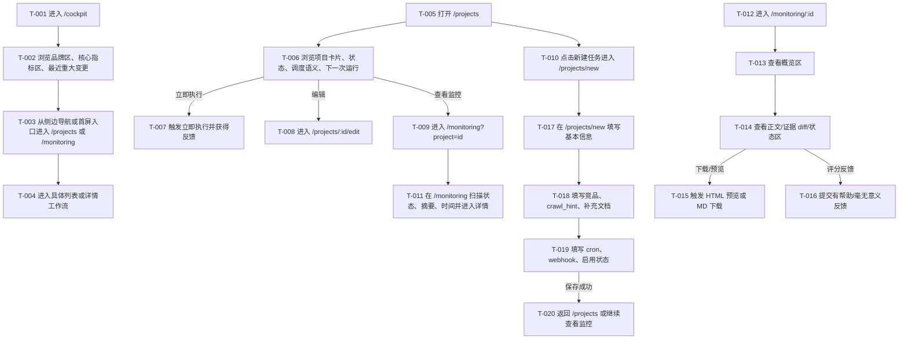

> 目的：把 `requirements/prd.md` 的核心场景/规则/AC，转写为可走查、可评审、可验证的交互说明，消除实现与验收歧义（不做视觉稿）。
>
> 规则：结论优先；只写会影响实现/验收的最小信息；本文档中不出现“待确认问题”清单，所有不确定性统一引用 PRD / solution 的验证清单。

## 0. 基本信息

- 需求标识（分支 / ID）：`011-linkfox-ui-redesign`
- 作者 / 参与评审：Codex（作者）；Melody（评审）
- 状态：draft
- 最后更新：2026-07-10
- Figma 链接入口：无（当前以 ASCII 线框为准）

---

## 1. 场景清单（与 PRD 对齐，必填）

| 场景编号 | 场景标题（用户视角） | 成功标准（1-3 条） | 任务流节点（T-xxx…） | 页面链路摘要（P-xxx → …） | PRD 对应 AC |
|---|---|---|---|---|---|
| S-001 | 在新仪表盘中快速进入主要工作流 | ① 首屏识别品牌与任务态势；② 快速进入主要入口；③ 仪表盘仍以工作台为主 | T-001~T-004 | P-001 → P-002 / P-004 / P-005 | AC-001~AC-003 |
| S-002 | 在列表页快速扫描状态并执行操作 | ① 状态/摘要/时间/操作可快速识别；② 操作路径直接；③ 保留扫描效率 | T-005~T-011 | P-002 / P-004 → P-006 | AC-004~AC-007 |
| S-003 | 在详情页与表单页完成深度阅读与配置 | ① 详情页分区清晰；② 表单分组清晰；③ 核心动作顺畅 | T-012~T-020 | P-006 / P-003 | AC-008~AC-012 |

---

## 2. 端到端任务流（必填）



---

## 3. 页面/弹窗清单（必填）

| Node ID | 类型（P/D/W） | 名称/目的 | 入口（从哪里来） | 覆盖任务流节点（T-xxx…） | 覆盖场景 | 备注 |
|---|---|---|---|---|---|---|
| P-001 | P | 品牌化工作台仪表盘 | 路由 `/cockpit` | T-001,T-002,T-003,T-004 | S-001 | 保持工作台首页定位 |
| P-002 | P | 项目列表页 | 路由 `/projects` | T-005,T-006,T-007,T-008,T-009 | S-001,S-002 | 卡片/分区列表形态 |
| P-003 | P | 项目表单页 | 路由 `/projects/new`、`/projects/:id/edit` | T-010,T-017,T-018,T-019,T-020 | S-003 | 分区编辑页 |
| P-004 | P | 监控列表页 | 路由 `/monitoring` | T-003,T-009,T-011 | S-001,S-002 | 状态与摘要扫描页 |
| P-005 | P | 全局导航骨架 | 所有页面共用 | T-001,T-003,T-005,T-009,T-012,T-017 | S-001,S-002,S-003 | `AppShell` 层级结构 |
| P-006 | P | 报告详情页 | 路由 `/monitoring/:id` | T-011,T-012,T-013,T-014,T-015,T-016 | S-002,S-003 | 双栏/分区详情页 |

---

## 4. 页面说明（逐页，必填）

### 4.1 P-005 全局导航骨架

#### 4.1.1 入口与目的

- **ID**：P-005
- **页面目的**：承载品牌区、侧边导航、顶部辅助信息区和统一页面容器，成为所有页面共享的骨架
- **入口**：任意前端路由
- **前置条件**：用户已进入应用
- **涉及场景**：S-001、S-002、S-003

#### 4.1.2 ASCII 线框（必填）

```text
P-005 全局导航骨架
+--------------------------------------------------------------------------------+
| 品牌区 / 顶部辅助栏                                                           |
| [Logo / 产品名 / 一句话]                 [当前页面标题] [刷新] [辅助信息]     |
+----------------------------+---------------------------------------------------+
| 侧边导航                    | 页面主容器                                        |
| - 仪表盘                    | +-----------------------------------------------+ |
| - 任务管理                  | | 页面内容区（对应 P-001 / P-002 / ...）        | |
| - 任务监控                  | |                                               | |
|                             | +-----------------------------------------------+ |
+----------------------------+---------------------------------------------------+
```

#### 4.1.3 关键状态与反馈

| 状态 | 触发条件 | 界面要点（展示/可操作性/提示） | 恢复路径（重试/返回/保留输入等） |
|---|---|---|---|
| 正常 | 页面正常加载 | 侧边导航清晰、品牌区可见、当前页面标题明确 | - |
| 加载 | 页面切换或局部刷新 | 顶部辅助区或内容区显示 loading，不遮挡导航 | 加载完成后恢复 |
| 空 | 某页面无内容 | 内容区显示统一空状态，不影响导航使用 | 返回上一级或前往创建页 |
| 错误 | 页面请求失败 | 内容区显示错误提示，导航仍可用 | 可刷新或切换页面 |
| 无权限 | 暂无此需求 | 保留占位口径，不新增权限交互 | - |

#### 4.1.4 关键校验与错误处理

- 导航激活态必须和当前路由一致
- 顶部辅助区不可压缩掉页面主标题与主要 CTA

#### 4.1.5 跳转与交互

- 侧边导航切换 `/cockpit`、`/projects`、`/monitoring`
- 顶部辅助区可承载刷新、返回、上下文信息

### 4.2 P-001 品牌化工作台仪表盘

#### 4.2.1 入口与目的

- **ID**：P-001
- **页面目的**：在更强品牌感下展示核心指标和最近重大变更，同时保持工作台首页属性
- **入口**：路由 `/cockpit`
- **前置条件**：存在项目与执行数据；无数据时仍需可用
- **涉及场景**：S-001

#### 4.2.2 ASCII 线框（必填）

```text
P-001 仪表盘
+------------------------------------------------------------------------------+
| 页面标题：监控仪表盘                                   [刷新数据]            |
+------------------------------------------------------------------------------+
| 品牌化概览区                                                                  |
| 产品定位一句话 / 今日监控态势 / 快速入口                                       |
| [任务管理] [任务监控]                                                          |
+------------------------------------------------------------------------------+
| 核心指标区                                                                    |
| [任务总数]    [24h 执行次数]    [24h 重大变更]                                 |
+------------------------------------------------------------------------------+
| 最近重大变更                                                                  |
| +--------------------------------------------------------------------------+ |
| | 时间 | 项目名 | 变化摘要 | [查看详情]                                   | |
| +--------------------------------------------------------------------------+ |
| 空状态：当前还没有可展示的重大变更记录                                       |
+------------------------------------------------------------------------------+
```

#### 4.2.3 关键状态与反馈

| 状态 | 触发条件 | 界面要点（展示/可操作性/提示） | 恢复路径（重试/返回/保留输入等） |
|---|---|---|---|
| 正常 | 数据加载成功 | 指标区、重大变更区、快捷入口可见 | - |
| 加载 | 页面初始化 / 手动刷新 | 关键模块 skeleton 或按钮 loading | 刷新完成后恢复 |
| 空 | 无重大变更或无项目 | 空状态 + 入口按钮仍保留 | 去创建任务或等待执行 |
| 错误 | 仪表盘数据请求失败 | 页面提示错误，核心结构不消失 | 点击刷新重试 |
| 无权限 | 暂无此需求 | - | - |

#### 4.2.4 关键校验与错误处理

- 品牌区只能服务导航与态势表达，不能挤占指标区和任务入口
- 最近重大变更列表只展示 `CHANGED`

#### 4.2.5 跳转与交互

- 点击快捷入口进入 `/projects` 或 `/monitoring`
- 点击重大变更卡片进入 `/monitoring/:id`
- 点击刷新重新拉取数据

### 4.3 P-002 项目列表页

#### 4.3.1 入口与目的

- **ID**：P-002
- **页面目的**：以更清晰的信息分区展示项目状态、调度语义、未来运行时间与核心操作
- **入口**：路由 `/projects`
- **前置条件**：项目可为空
- **涉及场景**：S-002

#### 4.3.2 ASCII 线框（必填）

```text
P-002 项目列表页
+------------------------------------------------------------------------------+
| 页面标题：任务管理                                          [新建任务]       |
+------------------------------------------------------------------------------+
| 项目卡片列表                                                                  |
| +--------------------------------------------------------------------------+ |
| | 项目名 / 状态开关             Cron / 调度语义 / 竞品数量                 | |
| | 接下来 5 次运行                                                         | |
| | 操作：[立即执行] [编辑] [查看监控]                                      | |
| +--------------------------------------------------------------------------+ |
| +--------------------------------------------------------------------------+ |
| | ...                                                                     | |
| +--------------------------------------------------------------------------+ |
| 空状态：当前还没有监控任务                                                 |
+------------------------------------------------------------------------------+
```

#### 4.3.3 关键状态与反馈

| 状态 | 触发条件 | 界面要点（展示/可操作性/提示） | 恢复路径（重试/返回/保留输入等） |
|---|---|---|---|
| 正常 | 有项目 | 卡片分区清晰，状态与操作直接可达 | - |
| 加载 | 初次加载或刷新 | 列表容器 loading | 加载完成后恢复 |
| 空 | 无项目 | 空状态 + 新建任务 CTA | 跳转新建页 |
| 错误 | 请求失败 | 错误提示，不隐藏创建入口 | 重试 |
| 无权限 | 暂无此需求 | - | - |

#### 4.3.4 关键校验与错误处理

- 状态开关 loading 时，避免重复触发
- 立即执行中需有明确 loading 反馈

#### 4.3.5 跳转与交互

- 新建任务进入 `/projects/new`
- 编辑进入 `/projects/:id/edit`
- 查看监控进入 `/monitoring?project=id`
- 立即执行触发即时执行接口

### 4.4 P-003 项目表单页

#### 4.4.1 入口与目的

- **ID**：P-003
- **页面目的**：以分区编辑页形式完成任务配置和编辑
- **入口**：`/projects/new`、`/projects/:id/edit`
- **前置条件**：创建时无；编辑时需先拉取项目数据
- **涉及场景**：S-003

#### 4.4.2 ASCII 线框（必填）

```text
P-003 项目表单页
+------------------------------------------------------------------------------+
| 页面标题：新增任务 / 编辑任务                                  [返回]        |
+------------------------------------------------------------------------------+
| 基本信息区                                                                    |
| 项目名称 [______________________________]                                     |
+------------------------------------------------------------------------------+
| 自有产品锚定区                                                                |
| 已上传文件：anchor.md [清除] [上传文件]                                       |
| [ 多行文本输入 ......................................................... ]    |
+------------------------------------------------------------------------------+
| 竞品配置区                                                                    |
| 竞品1：标题 [____] URL [________________]                                     |
| 采集提示词 [.......................................................]         |
| 补充文档：file.md [上传/清除]                                                 |
| 补充说明 [.......................................................]           |
| [新增一行]                                                                    |
+------------------------------------------------------------------------------+
| 调度与通知区                                                                  |
| Cron [____________________] [配置表达式]                                     |
| 语义：每天 09:00                                                              |
| Webhook [______________________________________________]                     |
| 任务状态 [启用/停用]                                                          |
+------------------------------------------------------------------------------+
| 页面级错误提示                                                                |
| 操作：[保存任务] [取消]                                                       |
+------------------------------------------------------------------------------+
```

#### 4.3.3 关键状态与反馈

| 状态 | 触发条件 | 界面要点（展示/可操作性/提示） | 恢复路径（重试/返回/保留输入等） |
|---|---|---|---|
| 正常 | 可编辑 | 分组结构清晰，字段按模块聚合 | - |
| 加载 | 编辑页加载项目 | 页面或区块 loading | 加载完成后恢复 |
| 空 | 创建页初始 | 提供默认一条竞品空行 | 继续填写 |
| 错误 | 保存失败 / 文件读取失败 | 页面级或字段级提示 | 修正后重试 |
| 无权限 | 暂无此需求 | - | - |

#### 4.4.4 关键校验与错误处理

- 每个竞品必须有 `title` 和 `url`
- `crawl_hint` 可为空
- 文档上传失败时需有页面级提示
- cron 非法时需在当前区块内提示

#### 4.4.5 跳转与交互

- 保存成功返回 `/projects`
- 取消返回列表
- 点击 cron 配置表达式打开配置弹层

### 4.5 P-004 监控列表页

#### 4.5.1 入口与目的

- **ID**：P-004
- **页面目的**：以更强层级展示执行记录、状态、摘要和详情入口
- **入口**：路由 `/monitoring`
- **前置条件**：执行记录可为空；支持项目过滤
- **涉及场景**：S-002

#### 4.5.2 ASCII 线框（必填）

```text
P-004 监控列表页
+------------------------------------------------------------------------------+
| 页面标题：任务执行情况                                   [返回全部] [刷新]   |
+------------------------------------------------------------------------------+
| 项目过滤提示条（可选）                                                        |
| 当前仅查看任务：XXX                                                           |
+------------------------------------------------------------------------------+
| 记录列表 / 表格                                                               |
| 任务 | 执行情况 | 变化摘要 | 评分 | 执行时间 | 操作                           |
| XXX  | CHANGED  | ...      | 未评分 | ...    | [查看详情]                    |
| XXX  | NO_CHANGE| ...      | 未评分 | ...    | [查看详情]                    |
| XXX  | ERROR... | ...      | 未评分 | ...    | [查看详情]                    |
| 空状态：当前没有可展示的任务执行记录                                          |
+------------------------------------------------------------------------------+
```

#### 4.5.3 关键状态与反馈

| 状态 | 触发条件 | 界面要点（展示/可操作性/提示） | 恢复路径（重试/返回/保留输入等） |
|---|---|---|---|
| 正常 | 有记录 | 状态、摘要、时间、操作稳定可见 | - |
| 加载 | 初始化 / 刷新 | 表格 loading | 刷新完成后恢复 |
| 空 | 无记录 | 空状态提示 | 返回项目页或等待执行 |
| 错误 | 请求失败 | 错误提示，仍保留筛选上下文 | 重试 |
| 无权限 | 暂无此需求 | - | - |

#### 4.5.4 关键校验与错误处理

- 项目过滤时需显示当前过滤上下文
- `NO_CHANGE`、`ERROR_CRAWL` 也必须保留详情入口

#### 4.5.5 跳转与交互

- 查看详情进入 `/monitoring/:id`
- 返回全部列表清空项目过滤
- 刷新重新拉取记录

### 4.6 P-006 报告详情页

#### 4.6.1 入口与目的

- **ID**：P-006
- **页面目的**：以概览区 + 正文区 + 证据区 + 反馈区的分层方式承载报告阅读
- **入口**：`/monitoring/:id`
- **前置条件**：需先加载报告详情数据
- **涉及场景**：S-002、S-003

#### 4.6.2 ASCII 线框（必填）

```text
P-006 报告详情页
+------------------------------------------------------------------------------+
| 页面标题：执行详情                                           [返回任务监控]  |
+------------------------------------------------------------------------------+
| 顶部概览区                                                                    |
| 项目名 / 报告ID / 状态标签 / 发布时间 / 反馈状态                               |
+--------------------------------------+---------------------------------------+
| 主内容区                              | 次内容区                              |
| - 报告预览 / 摘要 / 正文              | - 状态统计 / 反馈组件                 |
| - NO_CHANGE 原因                      | - 下载 MD / 打开 HTML                 |
| - diff 证据区                         |                                       |
| - ERROR_CRAWL 错误信息                |                                       |
+--------------------------------------+---------------------------------------+
```

#### 4.6.3 关键状态与反馈

| 状态 | 触发条件 | 界面要点（展示/可操作性/提示） | 恢复路径（重试/返回/保留输入等） |
|---|---|---|---|
| 正常 | 数据加载完成 | 概览区 + 正文区 + 反馈区完整可见 | - |
| 加载 | 初次进入 | Skeleton / 空白占位 | 加载完成后恢复 |
| 空 | 找不到报告 | 空状态提示 | 返回列表 |
| 错误 | 请求失败 | 错误提示且可返回 | 重试或返回 |
| 无权限 | 暂无此需求 | - | - |

#### 4.6.4 关键校验与错误处理

- 评分保存失败时不丢失当前输入
- `NO_CHANGE` 和 `ERROR_CRAWL` 状态下，概览区仍需保留，不可只剩一段文字
- diff 长文本区域需要稳定容器，不出现溢出破坏布局

#### 4.6.5 跳转与交互

- 返回任务监控列表
- 打开 HTML 报告新窗口
- 下载 MD
- 保存或清除评分

---

## 5. AC → 交互节点映射（如 PRD 存在则必须）

| AC-ID / 描述 | 场景 | 任务流节点（T-xxx…） | 页面/节点（P/D/W-xxx） | 验证点（状态/文案/按钮可用性/跳转结果） |
|---|---|---|---|---|
| AC-001 仪表盘首屏识别品牌区、指标区、主要入口 | S-001 | T-001,T-002 | P-001,P-005 | 首屏同时可见品牌表达、指标模块和快捷入口 |
| AC-002 从仪表盘进入项目或监控 | S-001 | T-003 | P-001,P-005 | 入口在首屏或单次导航层级可达 |
| AC-003 仪表盘不变成营销首页 | S-001 | T-002 | P-001 | 首屏核心内容仍为任务数据和操作入口 |
| AC-004 项目列表可识别关键字段 | S-002 | T-005,T-006 | P-002 | 项目名、状态、调度语义、竞品数量稳定可见 |
| AC-005 项目列表操作入口直接可用 | S-002 | T-007,T-008,T-009,T-010 | P-002 | 立即执行、编辑、查看监控、新建任务均显著可达 |
| AC-006 监控列表可识别状态/摘要/时间 | S-002 | T-009,T-011 | P-004 | 状态标签、变化摘要、执行时间、详情入口清晰 |
| AC-007 列表页保持高频扫描效率 | S-002 | T-006,T-011 | P-002,P-004 | 关键信息不跨多个层级反复查找 |
| AC-008 报告详情页存在强概览与清晰分层 | S-003 | T-012,T-013,T-014 | P-006 | 概览区、正文区、diff 区、反馈区分层明确 |
| AC-009 三种状态下详情页阅读路径稳定 | S-003 | T-014 | P-006 | CHANGED / NO_CHANGE / ERROR_CRAWL 均可稳定阅读 |
| AC-010 详情页评分/下载/预览可直接触达 | S-003 | T-015,T-016 | P-006 | 下载、HTML 预览、评分按钮显著可用 |
| AC-011 表单按配置模块分组展示 | S-003 | T-017,T-018,T-019 | P-003 | 基本信息、锚定、竞品、调度与通知分区明确 |
| AC-012 表单填写路径更清晰且保存不更重 | S-003 | T-017,T-018,T-019,T-020 | P-003 | 字段查找路径清晰，保存后回流自然 |

---

## 6. 走查/验证脚本（必须）

### 6.1 覆盖的验证清单条目（引用 `solution.md/prd.md`）

- V-001：品牌化导航升级后仍保持高效可达
- V-002：中等密度是否仍保持后台扫描效率
- V-003：详情页双栏/分区布局是否稳定
- V-004：LinkFox 风格是否形成统一规则而非局部模仿
- V-005：分区表单页是否仍保持配置效率

### 6.2 任务脚本（按场景）

**任务-1（S-001）**

- 任务目标：确认仪表盘在高保真参考新风格后，仍是工作台首页而非展示首页
- 关键步骤（引用 T-xxx/P-xxx）：
  1. 进入 T-001 / P-001
  2. 检查 T-002 中首屏结构
  3. 执行 T-003 进入项目页或监控页
- 成功标准：
  - 品牌区、指标区和主要入口同时清晰可见
  - 不需要额外滚动或二次跳转才能进入主要工作流
- 观察点/记录项：
  - 快捷入口是否足够显眼
  - 品牌层是否压过数据层

**任务-2（S-002）**

- 任务目标：确认列表页视觉升级后仍保留高频扫描和直接操作能力
- 关键步骤（引用 T-005~T-011 / P-002 / P-004）：
  1. 打开项目列表页
  2. 查看项目状态、调度语义和运行时间
  3. 依次执行立即执行、编辑、查看监控
  4. 打开监控列表并定位状态、摘要、时间、详情入口
- 成功标准：
  - 关键字段在首屏或一次滚动内可定位
  - 主要操作入口不被装饰性内容掩盖
- 观察点/记录项：
  - 列表阅读节奏是否更清晰
  - 状态和操作是否仍具备后台效率

**任务-3（S-003）**

- 任务目标：确认详情页与表单页的分区重构提升了阅读与配置体验
- 关键步骤（引用 T-012~T-020 / P-003 / P-006）：
  1. 打开一条报告详情
  2. 在三种状态数据下查看概览区、正文区、diff 区、反馈区
  3. 执行评分、预览、下载
  4. 打开项目创建/编辑页并完成一轮完整填写与保存
- 成功标准：
  - 详情页层次清晰，没有布局割裂
  - 表单字段更易定位，保存流程不变重
- 观察点/记录项：
  - diff 长内容是否稳定
  - 分区是否帮助理解而非增加负担

### 6.3 记录方式（问题清单模板）

| 问题 | 严重度（S1/S2/S3） | 复现步骤 | 影响范围（场景/页面/AC） | 建议修复方向 |
|---|---|---|---|---|
|  |  |  |  |  |

### 6.4 结论与回流

- 结论摘要：
  - 若导航入口、扫描效率、详情分层、表单效率四项均成立，则可进入实现计划
  - 若任一项不成立，优先回流当前原型和 PRD，对页面结构或 AC 做收敛修正
- 需要回流更新的文件：
  - `requirements/solution.md`（若问题影响推荐方案、边界或验证口径）
  - `requirements/prd.md`（若问题影响 AC、页面范围、业务规则）
  - `requirements/prototype.md`（若问题仅影响页面分区、走查路径、状态设计）

---

## 7. 追溯链接（Evidence & References）

- PRD：[requirements/prd.md](./prd.md)
- Solution：[requirements/solution.md](./solution.md)
- Raw：[requirements/raw.md](./raw.md)
- 术语与口径：[.aisdlc/project/memory/glossary.md](/Users/melody/code/ai-workshop/.aisdlc/project/memory/glossary.md)
- 现有代码证据：
  - [frontend/src/components/common/AppShell.vue](/Users/melody/code/ai-workshop/frontend/src/components/common/AppShell.vue)
  - [frontend/src/views/dashboard/CockpitPage.vue](/Users/melody/code/ai-workshop/frontend/src/views/dashboard/CockpitPage.vue)
  - [frontend/src/views/projects/ProjectListPage.vue](/Users/melody/code/ai-workshop/frontend/src/views/projects/ProjectListPage.vue)
  - [frontend/src/components/projects/ProjectForm.vue](/Users/melody/code/ai-workshop/frontend/src/components/projects/ProjectForm.vue)
  - [frontend/src/views/reports/ReportListPage.vue](/Users/melody/code/ai-workshop/frontend/src/views/reports/ReportListPage.vue)
  - [frontend/src/views/reports/ReportDetailPage.vue](/Users/melody/code/ai-workshop/frontend/src/views/reports/ReportDetailPage.vue)

---

## 8. R3-DoD 自检（完成标准）

- [x] 交互内容与 PRD 的场景/规则/AC 一一对应
- [x] 任务流、节点清单与页面清单一致（可追溯、可定位）
- [x] 每个页面至少包含：入口、ASCII 线框、状态、跳转
- [x] 关键状态覆盖完整（正常/加载/空/错/无权限）
- [x] 高风险操作的恢复路径已定义；暂无额外不可逆操作
- [x] 与 PRD 的 AC 可追溯
- [x] 至少包含一份走查/验证脚本章节
